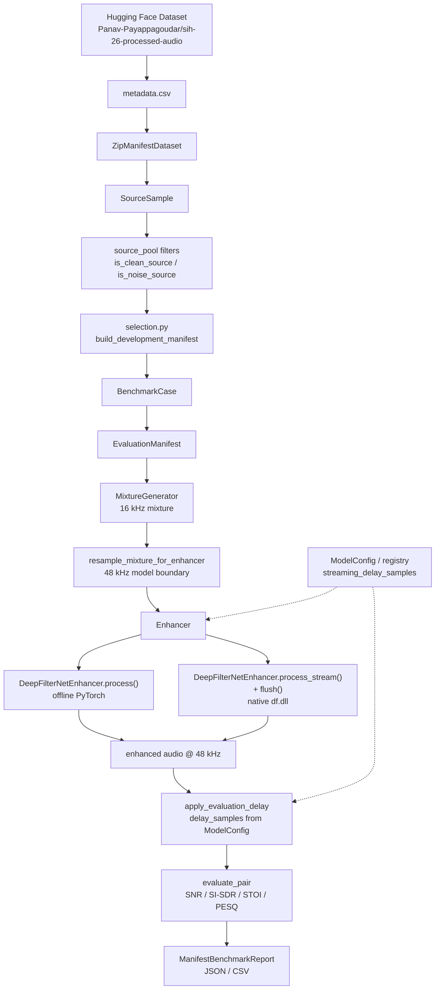

# DRDO-ANC Project Status

**Primary source of truth for developers and AI/Cursor sessions.**

This document describes what is **actually implemented** in the repository as of the last verification date at the bottom. Items not confirmed in code are marked `UNKNOWN`, `PARTIAL`, or `PLANNED`.

---

## 1. Project Overview

**DRDO-ANC** is an AI/ML-enabled adaptive noise cancellation / speech enhancement project for defence communication. The current repository infrastructure supports:

1. Loading a large Hugging Face audio corpus lazily from ZIP-backed manifests
2. Building **deterministic, reproducible benchmark cases** (clean + noise + SNR)
3. Running **DeepFilterNet3 (DF3)** in offline and native streaming modes
4. **Live microphone → enhancer → speaker** streaming via a synchronous I/O pipeline
5. Evaluating enhancement with shared objective metrics and streaming delay compensation
6. **NLMS adaptive residual-noise filter** as a model-independent DSP primitive (not yet integrated into the live pipeline)

The codebase is intentionally layered:

```text
Dataset / Data Infrastructure
        ↓
Benchmark Infrastructure
        ↓
Enhancement Models
        ↓
Evaluation
        ↓
DSP (adaptive residual filtering — standalone core)
```

| Layer | Responsibility |
|-------|----------------|
| **Dataset** | Discover source clips, read metadata, lazy ZIP access, represent `SourceSample` |
| **Benchmark** | Select cases, build manifests, generate mixtures, run benchmarks, store results |
| **Enhancement** | Model abstraction (`Enhancer`) and concrete implementations (currently DF3) |
| **Evaluation** | Delay alignment, SNR / SI-SDR / STOI / PESQ |
| **Classification** | Rule-based noise-type analysis (`NoiseClassifier`) — isolated from live DF3 path |
| **DSP** | Model-independent adaptive residual filtering (`NLMSFilter`) |

Training and fine-tuning are **out of scope** for the benchmark infrastructure; teammates may add new `Enhancer` implementations that plug into the same benchmark path.

**Planned hybrid live path (not integrated yet):**

```text
Microphone → preprocessing → AI speech enhancer → adaptive residual filter (NLMS) → output
```

The NLMS core exists as a validated standalone primitive. DeepFilterNet, live I/O, and stereo reference-channel investigation are separate follow-on tasks.

---

## 2. Current Architecture



**Offline vs streaming divergence** happens inside `DeepFilterNetEnhancer` after the same 48 kHz noisy input is produced:

| Path | Enhancement API | Backend | Evaluation `delay_samples` |
|------|-----------------|---------|----------------------------|
| Offline | `process()` | PyTorch `df.enhance` | `0` |
| Streaming | `process_stream()` + `flush()` | `NativeDF3Backend` via `df.dll` | `1440` at 48 kHz (from `ModelConfig` for DeepFilterNet3) |

Both paths share the same upstream pipeline: manifest → mixture @ 16 kHz → resample → enhancer.

---

## 3. Repository File Map

### Audio (`src/drdo_anc/audio/`)

| File | Responsibility | Status | Important APIs / Notes |
|------|----------------|--------|------------------------|
| `io.py` | WAV load/save | DONE | `load_mono_wav`, `load_mono_wav_bytes`, `save_mono_wav` |
| `mixing.py` | Deterministic SNR mixing | DONE | `align_noise_to_clean_length`, `scale_noise_to_snr`, `create_mixture`, `calculate_snr` |
| `resampling.py` | Model-boundary resampling | DONE | `resample_mono` — uses `scipy.signal.resample_poly` |
| `live/interfaces.py` | Hardware-independent live I/O ABCs | DONE | `AudioInput`, `AudioOutput` |
| `live/fake.py` | In-memory I/O for tests | DONE | `FakeAudioInput`, `FakeAudioOutput` |
| `live/sounddevice_backend.py` | Desktop mic/speaker backend | DONE | Duplex `sd.Stream` via `open_sounddevice_io()`; stereo downmix/upmix; `SoundDeviceStreamStats` |
| `live/alignment.py` | Recording length lifecycle tracking | DONE | `RecordingLengthTracker` — stable leading-gap detection for post-flush alignment |
| `live/recorder.py` | Live session recording | DONE | `LiveStreamRecorder`, `align_recorded_streams`, `LiveInstrumentation`, async WAV writer with bounded queue |
| `live/session_analysis.py` | Offline live-session analysis | DONE | `analyze_live_session`, `find_energy_drop_windows` — delay-compensated energy-drop windows |
| `live/replay.py` | Deterministic live session replay | DONE | `replay_wav_file`, `replay_wav_through_enhancer` — reuses `StreamingPipeline` + fake I/O |
| `live/multimic.py` | Dual-mic reference architecture | DONE | `MultiMicConfig`, `MultiChannelAudioInput`, `ChannelRouter`, `RoutedPrimaryAudioInput`, `DualMicResidualFrame`, `analyze_channel_pair` — channel assignment is configuration, not hardcoded |
| `live/capture_ux.py` | Shared capture terminal UX | DONE | Countdown, progress bar, completion/failure messages — shared by dual-mic and independent-mic experiment scripts |
| `live/independent_mic.py` | Independent-device dual-mic capture | DONE | `IndependentMicConfig`, `record_independent_microphones`, `analyze_independent_pair`, `prepare_independent_pair_for_analysis` — parallel threads, optional per-device sample rates (`reference_sample_rate`), `synchronization=independent_devices`, drift/delay reporting |
| `live/sounddevice_multimic.py` | Synchronized multi-channel capture | DONE | `SoundDeviceMultiChannelInput`, `record_dual_microphone`, `FakeMultiChannelAudioInput` — one `InputStream` clock |
| `live/pipeline.py` | Live streaming orchestration | DONE | `StreamingPipeline` — optional `recorder=`; `instrumentation=`; flush tail via `note_flush_enhanced` |
| `live/__init__.py` | Public live-audio exports | DONE | |
| `__init__.py` | Public audio exports | DONE | Re-exports io, mixing, resampling, live helpers |

### Dataset (`src/drdo_anc/dataset/`)

| File | Responsibility | Status | Important APIs / Notes |
|------|----------------|--------|------------------------|
| `manifest.py` | Metadata CSV parsing | DONE | `load_metadata_rows`, `METADATA_COLUMNS`, `SIH26_REPO_ID` |
| `source_sample.py` | Raw source clip metadata | DONE | `SourceSample` dataclass |
| `sample.py` | Benchmark-ready pair metadata | DONE | `AudioSample` (WAV-path based; used by `BenchmarkRunner`) |
| `protocol.py` | Dataset protocols | DONE | `Dataset`, `SourceDataset` ABCs |
| `list_dataset.py` | In-memory list dataset | DONE | `ListDataset` |
| `zip_access.py` | Lazy ZIP member reads | DONE | `ZipArchiveCache` |
| `zip_manifest_dataset.py` | HF ZIP manifest adapter | DONE | `ZipManifestDataset`, `load_audio`, `from_hf_hub` |
| `source_pool.py` | Clean/noise filtering & constants | DONE | `is_clean_source`, `is_noise_source`, `NOISE_CATEGORY_SOURCES`, development protocol constants |
| `__init__.py` | Public dataset exports | DONE | |

### Enhancement (`src/drdo_anc/enhancement/`)

| File | Responsibility | Status | Important APIs / Notes |
|------|----------------|--------|------------------------|
| `base.py` | Model abstraction | DONE | `Enhancer` ABC |
| `registry.py` | Model configuration registry | DONE | `ModelConfig`, `register_model`, `get_model_config`, `list_models`, `create_enhancer` — DeepFilterNet3 and DeepFilterNet3-Finetuned registered at import |
| `deepfilternet.py` | DF3 offline + streaming wrapper | DONE | `DeepFilterNetEnhancer` — loads PyTorch + native backends; `init_df` 3-tuple/4-tuple unpack |
| `finetuned.py` | Fine-tuned DF3 enhancer | DONE | `FineTunedDeepFilterNetEnhancer` — epoch-130 checkpoint + derived ONNX tar.gz; does not modify `models/dfn3_finetuned/` |
| `native.py` | ctypes wrapper for `df.dll` | DONE | `NativeDF3Backend` — `df_create`, `df_process_frame`, `df_free` |
| `streaming.py` | Chunk → frame adapter | DONE | `StreamingBuffer` |
| `__init__.py` | Public enhancement exports | DONE | `Enhancer`, `DeepFilterNetEnhancer`, `FineTunedDeepFilterNetEnhancer`, registry helpers |

### Evaluation (`src/drdo_anc/evaluation/`)

| File | Responsibility | Status | Important APIs / Notes |
|------|----------------|--------|------------------------|
| `delay.py` | Evaluation alignment | DONE | `apply_evaluation_delay`, `format_delay_compensation` |
| `metrics.py` | Objective metrics | DONE | `calculate_snr`, `calculate_si_sdr`, `calculate_stoi`, `calculate_pesq`, `evaluate_pair`, `evaluate_model` |
| `__init__.py` | Public evaluation exports | DONE | |

### DSP (`src/drdo_anc/dsp/`)

| File | Responsibility | Status | Important APIs / Notes |
|------|----------------|--------|------------------------|
| `adaptive_filter.py` | NLMS adaptive residual-noise filter | DONE | `NLMSFilter` — stateful mono `[T]` `process(primary, reference)`, `reset()`; `float32`; no model/hardware imports |
| `__init__.py` | Public DSP exports | DONE | Re-exports `NLMSFilter` |

**Not a complete ANC system:** requires a suitable reference signal. Single-microphone stereo-channel investigation and DF3 integration are later stages.

### Classification (`src/drdo_anc/classification/`)

| File | Responsibility | Status | Important APIs / Notes |
|------|----------------|--------|------------------------|
| `categories.py` | Defence noise labels | DONE | `NOISE_CLASSES`, `DEFENCE_NOISE_CATEGORIES`, `UNKNOWN_CLASS` |
| `features.py` | Deterministic feature extraction | DONE | `extract_features`, `feature_vector`, `FEATURE_VERSION=noise-features-v1` — unchanged for v2 |
| `base.py` | Shared classifier API | DONE | `NoiseClassifierBase`, `ClassificationResult` (+ `confidence`) |
| `classifier.py` | Rule-based classifier (v1) | DONE | `NoiseClassifier` — preserved for comparison; not retuned |
| `source_identity.py` | Recording-level grouping keys | DONE | ESC-50 clip IDs / firearm UUIDs / unique drone sample IDs |
| `supervised.py` | Supervised classifier (v2) | DONE | `SupervisedNoiseClassifier` — same `process_chunk` / `classify_buffered` API; joblib save/load |
| `training.py` | Dataset split + candidate training | DONE | Stratified recording-safe split; LR / RF / ExtraTrees; class_weight imbalance handling |
| `evaluation.py` | Benchmark + real-corpus evaluation | DONE | `run_classifier_benchmark`, `build_defence_noise_corpus`, `run_noise_corpus_evaluation` |
| `__init__.py` | Public classification exports | DONE | v1 + v2 classifiers and features |

**Isolated analysis module:** not wired into `StreamingPipeline`, GUI, or DF3.

### Experiments (`src/drdo_anc/experiments/`)

| File | Responsibility | Status | Important APIs / Notes |
|------|----------------|--------|------------------------|
| `noise_aware/strategies.py` | Classifier → strategy mapping | DONE | Documented DF3 `atten_lim_db` only; unknown/malformed fallback to `df3_full` |
| `noise_aware/classical.py` | Spectral-subtraction baseline | DONE | Deterministic experiment-local classical enhancer |
| `noise_aware/runner.py` | Offline experiment runner | DONE | Same 60-case mixtures; noisy/classical/DF3/adaptive; paired DF3 vs adaptive stats |
| `noise_aware/__init__.py` | Public experiment exports | DONE | |
| `finetuned_compare/compare.py` | Paired pretrained vs fine-tuned report compare | DONE | Pairs by `(case_id, mode)`; SI-SDR/STOI/PESQ/SNR deltas |
| `finetuned_compare/heldout.py` | Recording-safe independent SIH-26 eval construction | DONE | Provenance inspection; disjoint from `sih26-eval-v1`; no training-holdout claim unless a file list is supplied |
| `finetuned_compare/__init__.py` | Public compare exports | DONE | |

### GUI (`src/drdo_anc/gui/`)

| File | Responsibility | Status | Important APIs / Notes |
|------|----------------|--------|------------------------|
| `app.py` | PySide6 `QGuiApplication` + QML engine bootstrap | DONE | `run_gui()` — exposes `guiBridge` to QML; `on_ready` / `on_shutdown` lifecycle hooks |
| `bridge.py` | QObject telemetry bridge | DONE | `GUIBridge` — 60 FPS `QTimer`; thread-safe latest-value handoff from audio thread; QML properties |
| `telemetry.py` | Scalar telemetry dataclass | DONE | `AudioTelemetry` |
| `waveform.py` | Visualization downsampling | DONE | `WaveformProcessor` — peak-preserving reduce to 500 points |
| `qml/Main.qml` | Main telemetry console window | DONE | Waveforms, meters, sparklines, error banner |
| `qml/Waveform.qml` | Canvas oscilloscope | DONE | Raw/enhanced waveform rendering |
| `qml/Metrics.qml` | LED meters + metric grids | DONE | Peak/RMS, latency, buffer, drops, RTF |
| `demo.py` | Demo mode replay controller | DONE | `ReplayAudioInput`, `DemoAudioController`, `SelectableAudioOutput`, `DemoPipelineOutput` — WAV → `StreamingPipeline`; persisted `_ab_mode` |
| `demo_manifest.py` | Validated demo catalog loader | DONE | `load_validated_demo_catalog()` — file/RMS/length checks; raises `DemoManifestError` |
| `demo_scenarios.json` | Demo scenario manifest (`demo-train-v1`) | DONE | Single training triplet: train_noisy / train_clean / train_enh |
| `playback_queue.py` | Bounded demo playback queue | DONE | `QueuedPlaybackOutput`, `ABQueuedPlaybackOutput` — decouples DF3 from PortAudio; A/B selected at dequeue time |
| `session.py` | Demo + live session coordinator | DONE | `ApplicationSession` — mode switch, transport controls |
| `qml/DemoControls.qml` | Demo transport + scenario UI | DONE | Play/pause/stop, A/B, mode switch, shortcuts |
| `qml/DemoPanel.qml` | Factual demo status panel | DONE | Model, latency, RTF, benchmark summary |
| `qml/DemoButton.qml` | Reusable control button | DONE | |
| `qml/PipelineChain.qml` | Subtle pipeline stage indicator | DONE | INPUT → CAPTURE → STREAM → DF3 → OUTPUT |

### Benchmark (`src/drdo_anc/benchmark/`)

| File | Responsibility | Status | Important APIs / Notes |
|------|----------------|--------|------------------------|
| `case.py` | Reproducible case definition | DONE | `BenchmarkCase` |
| `evaluation_manifest.py` | Fixed evaluation manifest | DONE | `EvaluationManifest` — JSON save/load |
| `selection.py` | Deterministic case selection | DONE | `build_evaluation_manifest`, `build_development_manifest` |
| `mixture.py` | Mixture generation | DONE | `MixtureGenerator`, `MixtureResult` — in-memory cache |
| `config.py` | Benchmark configuration | DONE | `BenchmarkMode`, `BenchmarkConfig`, `STREAMING_CHUNK_SIZES` |
| `runner.py` | WAV-path benchmark runner | DONE | `BenchmarkRunner` — uses `AudioSample` + on-disk WAVs |
| `manifest_benchmark.py` | Manifest-driven enhancer benchmark | DONE | `ManifestBenchmarkRunner` (generic `Enhancer`), `ManifestCaseResult`, `ManifestBenchmarkReport` — takes `streaming_delay_samples` from model config |
| `result.py` | Runner result types | DONE | `SampleResult`, `BenchmarkResult` |
| `__init__.py` | Public benchmark exports | DONE | |

### Scripts (`scripts/`)

| File | Responsibility | Status | Important APIs / Notes |
|------|----------------|--------|------------------------|
| `run_df3_manifest_benchmark.py` | **Primary** 60-case manifest benchmark CLI | DONE | Smoke + full run, mandatory validation, JSON/CSV output; `--model` selects registered enhancer (default: DeepFilterNet3) |
| `run_dfn3_finetuned_benchmark.py` | Pretrained vs fine-tuned head-to-head | DONE | Same 60-case manifest; sequential model loads; writes `data/benchmark_results/dfn3_finetuned_compare/` |
| `test_dfn3_finetuned.py` | Fine-tuned artifact + registry tests | DONE | Paths, ONNX bundle layout, comparison math; optional `DFN3_FINETUNED_INTEGRATION=1` load |
| `run_dfn3_recording_safe_eval.py` | Recording-disjoint SIH-26 eval | DONE | Independent 60-case set; provenance-unverified vs training; does not modify `sih26-eval-v1` |
| `test_dfn3_recording_safe_eval.py` | Recording-safe construction tests | DONE | Unverified provenance; fixture cannot supply extra speakers; development protocol unchanged |
| `test_df3_manifest_benchmark.py` | Manifest benchmark tests | DONE | Mock + registry + optional HF/DF3 integration (`SIH26_INTEGRATION=1`) |
| `test_evaluation_manifest.py` | Manifest + mixture tests | DONE | 14 tests including distribution, SNR accuracy, determinism |
| `test_zip_manifest_dataset.py` | Dataset adapter tests | DONE | Unit + optional `SIH26_INTEGRATION=1` |
| `test_benchmark_runner.py` | Generic runner tests | DONE | Mock + DF3 on local Freesound WAVs |
| `test_evaluate_delay.py` | Delay compensation regression | DONE | Pins historical Freesound alignment metrics |
| `test_streaming_backend.py` | Native backend smoke test | DONE | Frame processing, buffer, reset |
| `test_enhancer_streaming.py` | Enhancer streaming smoke | DONE | Arbitrary chunk sizes |
| `run_live_enhancement.py` | Live mic → enhancer → speaker CLI | DONE | `--model`, `--passthrough`, `--diagnose-audio`, `--record-dir`, duplex I/O |
| `test_live_audio.py` | Live audio pipeline tests | DONE | Fake I/O only — no physical microphone required |
| `test_live_recording.py` | Live recording tests | DONE | WAV/session/metadata validation; delayed-enhancer alignment; energy-drop analysis |
| `analyze_live_session.py` | Offline live-session analysis CLI | DONE | Delay-compensated energy-drop window report for a session directory |
| `replay_live_session.py` | Live session replay CLI | DONE | Replay `input.wav` through any registered model via `process_stream()` + `flush()` |
| `test_live_replay.py` | Live replay tests | DONE | Fake enhancer; arbitrary chunk sizes; determinism; metadata |
| `test_adaptive_filter.py` | NLMS adaptive filter tests | DONE | Synthetic correlated-noise attenuation; streaming/full equivalence; stability; reset |
| `run_noise_classifier_benchmark.py` | Noise classifier benchmark CLI | DONE | 60-case development manifest; confusion matrix + per-class metrics; JSON report |
| `run_noise_classifier_corpus_eval.py` | Real SIH-26 defence-noise corpus eval | DONE | All labelled `uav_drone` / `vehicle_engine` / `impulsive_firearms` clips; unknown reported separately; writes `noise_classifier_v1_real_corpus_report.json` |
| `train_noise_classifier_v2.py` | Train/evaluate Noise Classifier v2 | DONE | Stratified recording-safe split; LR/RF/ExtraTrees; selects by validation macro F1; saves model + report under `data/classifier_results/noise_classifier_v2/` |
| `run_noise_aware_enhancement_experiment.py` | Offline noise-aware enhancement experiment | DONE | Same 60-case manifest; noisy / classical / DF3 / adaptive via documented `atten_lim_db`; writes JSON report |
| `test_noise_aware_enhancement.py` | Noise-aware strategy tests | DONE | Mapping, fallback, malformed output, determinism, classical baseline |
| `test_noise_classifier.py` | Noise classifier unit tests | DONE | Feature extraction, silence/speech/engine/drone/impulsive, chunk sizes, NaN/Inf, determinism |
| `test_noise_classifier_corpus.py` | Corpus evaluation tests | DONE | Deterministic clip set, missing-archive reporting, unknown≠correct; optional `SIH26_INTEGRATION=1` smoke |
| `test_noise_classifier_v2.py` | Supervised v2 tests | DONE | Split determinism, no recording leakage, save/load, probs, chunks, NaN/Inf, deterministic inference |
| `test_dual_microphone.py` | Dual-mic reference capture tests | DONE | Synthetic routing/analysis tests; `--capture` hardware diagnostic writes `primary.wav` / `reference.wav` / `stereo.wav` |
| `test_independent_microphones.py` | Independent-device mic experiment | DONE | Parallel capture from two input devices; drift/delay analysis; optional per-device sample rates; `--capture` writes `primary.wav` / `reference.wav` / `metadata.json` |
| `run_usb_bluetooth_dual_mic_experiment.py` | USB-C + Bluetooth dual-mic hardware experiment (Task 6) | DONE | Reuses `independent_mic`; compatibility probe, 60 s + 5 min drift + stability captures; writes `report.txt` + metadata under `data/usb_bluetooth_dual_mic_experiment/` |
| `test_live_passthrough.py` | Hardware passthrough diagnostics | DONE | Minimal duplex, pipeline, sine, capture-to-WAV modes |
| `run_live_gui.py` | Real-time telemetry GUI launcher | DONE | PySide6 + QML; `--passthrough`, `--model`, `--fake`, device selection |
| `run_live_soak.py` | Continuous live soak + JSON report | DONE | Mic → registered enhancer → headphones; `--model` (default DeepFilterNet3); RTF, overflows, latency estimate |
| `test_dfn3_finetuned_live.py` | Fine-tuned live-path smoke | DONE | Registry + load/stream/flush/reset + `StreamingPipeline` fake I/O for pretrained and fine-tuned |
| `test_gui_waveform.py` | GUI waveform downsampling tests | DONE | Empty/small/large chunk handling; no Qt or microphone required |
| `run_demo_playback_timing.py` | Demo playback timing report | DONE | Write-interval stats for jitter diagnosis |
| `test_gui_demo.py` | Demo mode streaming tests | DONE | train_* manifest, live B, playback queue, A/B sync + dequeue routing (21 tests) |
| `build_evaluation_fixtures.py` | Local manifest fixtures | DONE | Builds `tests/fixtures/evaluation_manifest/` at test time |
| `evaluate.py` | Thin evaluation CLI | DONE | Wraps `drdo_anc.evaluation` |
| `investigate_streaming_alignment.py` | Alignment investigation (read-only) | DONE | Offset sweep; not part of CI |
| `run_streaming_benchmark.py` | Legacy single-file streaming demo | DONE | Pre-manifest experiment script |
| `mix_audio.py` | Manual mixing utility | DONE | Pre-manifest SNR mixing |
| `run_enhancement.py`, `run_deepfilternet.py`, `run_snr_enhancement.py` | Enhancement CLIs | DONE | Pre-benchmark workflows |
| `evaluate_snr_sweep.py`, `run_snr_sweep.py` | SNR sweep utilities | DONE | **Caution:** offline vs streaming delay mismatch if misconfigured |
| `test_df_native.py`, `test_df_native_frame.py`, `test_df_streaming_wav.py`, `test_df_latency.py` | DF3 development tests | DONE | Lower-level DF3 validation |
| `analyze_streaming_alignment.py` | Alignment analysis helper | DONE | Investigation utility |

### Tests / fixtures

| Path | Responsibility | Status | Notes |
|------|----------------|--------|-------|
| `tests/fixtures/zip_manifest/` | ZipManifestDataset fixtures | DONE | Generated by `test_zip_manifest_dataset.py` if missing |
| `tests/fixtures/evaluation_manifest/` | Manifest/mixture fixtures | DONE | Generated by `build_evaluation_fixtures.py` |
| `data/classifier_results/` | Classifier + noise-aware experiment artifacts | DONE | v1/v2 reports; v2 `selected_model/`; `noise_aware_enhancement_v1/` |
| `data/benchmark_results/dfn3_finetuned_compare/` | Fine-tuned vs pretrained reports | DONE (local) | `pretrained_*.json`, `finetuned_*.json`, `comparison_*.json` |
| `data/benchmark_results/dfn3_finetuned_recording_safe/` | Recording-disjoint SIH-26 eval | DONE (local) | Independent of `sih26-eval-v1`; training hold-out **unverified** |
| `models/dfn3_finetuned/` | Teammate fine-tuned DF3 artifact | DONE (local) | Unmodified extract; ONNX + epoch-130 checkpoint |
| `tests/` (top-level pytest suite) | — | **NOT DONE** | No committed pytest suite; tests live under `scripts/test_*.py` |

### Benchmark results (`data/benchmark_results/`)

| File | Responsibility | Status | Notes |
|------|----------------|--------|-------|
| `df3_manifest_benchmark_smoke.json` | 2-case smoke results | DONE | 4 rows (2 cases × 2 modes), 0 failures |
| `df3_manifest_benchmark_full.json` | 60-case full results | DONE | 120 rows (60 cases × 2 modes), 0 failures |
| `df3_manifest_benchmark_*.csv` | Tabular exports | PARTIAL | May exist locally; `*.csv` is gitignored |

### External / vendor

| Path | Responsibility | Status | Notes |
|------|----------------|--------|-------|
| `external/DeepFilterNet/` | Upstream DF3 source + build artifacts | DONE (local) | Gitignored; requires local build of `df.dll` |
| `external/DeepFilterNet/target/release/df.dll` | Native streaming library | DONE (local) | Required for streaming; path configured in `deepfilternet.py` |
| `external/DeepFilterNet/models/DeepFilterNet3_onnx.tar.gz` | Native model bundle | DONE (local) | Used by `NativeDF3Backend` |

---

## 4. Enhancement Architecture

### `Enhancer` abstraction

Defined in `src/drdo_anc/enhancement/base.py`:

```text
Enhancer (ABC)
   ├── DeepFilterNetEnhancer
   └── FineTunedDeepFilterNetEnhancer

ModelConfig / registry
   ├── DeepFilterNet3 (streaming_delay_samples=1440)
   └── DeepFilterNet3-Finetuned (streaming_delay_samples=1440)
```

### Model registry

Implemented in `src/drdo_anc/enhancement/registry.py`:

| API | Purpose |
|-----|---------|
| `ModelConfig` | Frozen dataclass: `name`, `streaming_delay_samples`, `factory` |
| `register_model()` | Register a new enhancer configuration by name |
| `get_model_config()` | Look up configuration for CLI / benchmark wiring |
| `list_models()` | Return sorted registered model names |
| `create_enhancer()` | Instantiate (and optionally `load()`) a registered enhancer |

**Registered models (built-in):**

| Name | Factory | `streaming_delay_samples` |
|------|---------|---------------------------|
| `DeepFilterNet3` | `DeepFilterNetEnhancer` | `1440` |
| `DeepFilterNet3-Finetuned` | `FineTunedDeepFilterNetEnhancer` | `1440` |

Teammate fine-tuned models register via `register_model(ModelConfig(...))` before benchmark execution. Each model supplies its own streaming delay; offline delay remains `0` for all models.

| Method | Purpose | Infrastructure vs model-specific |
|--------|---------|-----------------------------------|
| `load()` | Load model weights and processing state | Model-specific |
| `process(audio)` | Enhance a complete utterance | Model-specific backend choice |
| `process_stream(audio_chunk)` | Enhance an arbitrary chunk | Model-specific; infrastructure provides chunk cycling in runners |
| `flush()` | Emit remaining buffered output | Model-specific |
| `reset()` | Reset streaming/native state | Model-specific |
| `sample_rate()` | Expected input sample rate | Model-specific |
| `name()` | Human-readable model name | Model-specific |

**Infrastructure-level** concerns (outside `Enhancer`):

- Manifest-driven mixture generation
- 16 kHz → 48 kHz resampling at model boundary
- Chunk size sequences in benchmark runners
- Evaluation delay compensation
- Metric calculation

**Future fine-tuned models** should implement the same `Enhancer` interface so `BenchmarkRunner` / `ManifestBenchmarkRunner` can compare models fairly on identical noisy inputs.

---

## 5. DeepFilterNet3 Implementation

### Offline path

```text
PyTorch checkpoint (via df.init_df)
    ↓
DeepFilterNetEnhancer.process()
    ↓
df.enhance(model, df_state, audio)
```

- Loaded from DeepFilterNet Python package (`from df import enhance, init_df`)
- Checkpoint cached under user home (e.g. `DeepFilterNet/Cache/DeepFilterNet3`)
- Expects **48 kHz** floating-point mono tensor `[1, T]`
- `load()` unpacks both 3-tuple and 4-tuple `init_df()` returns (installed `df` 3.x returns 3 values)

### Streaming path

```text
Python (DeepFilterNetEnhancer.process_stream)
    ↓
StreamingBuffer (arbitrary chunk → 480-sample frames)
    ↓
NativeDF3Backend.process_frame (ctypes)
    ↓
external/DeepFilterNet/target/release/df.dll
    ↓
df_create / df_process_frame / df_free
    ↓
persistent native DF3 state
```

| Item | Value / location |
|------|------------------|
| DLL path (repo-relative) | `external/DeepFilterNet/target/release/df.dll` |
| Model path (repo-relative) | `external/DeepFilterNet/models/DeepFilterNet3_onnx.tar.gz` |
| Model format | ONNX bundle inside `.tar.gz` (native tract backend) |
| Frame size | **480 samples** (`NativeDF3Backend.frame_length()` after load) |
| Frame duration @ 48 kHz | **10 ms** (480 / 48000) |
| Native API functions | `df_create`, `df_get_frame_length`, `df_process_frame`, `df_free` |
| Attenuation limit default | `100.0` dB (`NativeDF3Backend`) |

### State lifecycle

1. `DeepFilterNetEnhancer.load()` creates offline PyTorch model **and** native backend + `StreamingBuffer`
2. `process_stream()` appends chunks to `StreamingBuffer`, processes complete 480-sample frames
3. `flush()` zero-pads the final partial frame, processes one frame, returns only samples corresponding to real input
4. `reset()` calls `NativeDF3Backend.reset()` (destroys and recreates native state) and clears `StreamingBuffer`

### Output-length guarantee (streaming)

After `process_stream` over the full input **plus** `flush()`, benchmark runners require `len(enhanced) == len(noisy)`. Enforced in `BenchmarkRunner._enhance_streaming` and `ManifestBenchmarkRunner._enhance_streaming`.

> **Note:** `deepfilternet.py` contains unreachable duplicate code after the first `flush()` implementation (lines following the first `return`). The active implementation is the first block. Cleanup is `PLANNED` but not required for correctness.

---

## 6. Streaming Architecture

### Incoming chunk vs DF3 frame

| Concept | Size | Where |
|---------|------|-------|
| **Incoming chunk** | Arbitrary (e.g. 300, 700, 250, …) | Benchmark runner feeds `process_stream` |
| **DF3 processing frame** | Fixed 480 samples | `StreamingBuffer.frame_length` |

`StreamingBuffer` (`src/drdo_anc/enhancement/streaming.py`):

1. **`append(audio)`** — concatenate to internal buffer, emit zero or more complete 480-sample frames
2. **`pending_samples()`** — count of samples not yet forming a full frame
3. **`flush()`** — return and clear remaining partial buffer (used internally; final padding happens in `DeepFilterNetEnhancer.flush()`)
4. **`clear()`** — reset buffer without emitting

### Example

```text
Append 300 samples → 0 frames emitted, 300 pending
Append 700 samples → buffer 1000 → 2 frames (960 samples) emitted, 40 pending
```

At end of utterance, `DeepFilterNetEnhancer.flush()` pads the 40 pending samples to 480, processes one native frame, returns 40 enhanced samples.

Benchmark runners cycle through `STREAMING_CHUNK_SIZES` in `src/drdo_anc/benchmark/config.py`:

```python
(300, 700, 250, 1000, 137, 911, 2048, 512, 1536, 800, 1200)
```

---

## 7. The 1440-Sample / 30 ms Delay

### Definition

```text
1440 samples ÷ 48000 Hz = 0.030 s = 30 ms
```

This is an **algorithmic alignment offset** of the native streaming DF3 output relative to the clean/noisy timeline at the **model sample rate (48 kHz)**.

### Evaluation policy

| Mode | `delay_samples` | Where set |
|------|-----------------|-----------|
| Offline | `0` | `ManifestBenchmarkRunner` / `BenchmarkConfig` |
| Streaming | Model-specific (e.g. `1440` for DeepFilterNet3) | `ModelConfig.streaming_delay_samples` → passed to `ManifestBenchmarkRunner` as `streaming_delay_samples`; `delay_samples_for_mode()` applies it per mode |

Compensation is applied in **`evaluation.delay.apply_evaluation_delay`**, not inside the streaming model. The first `delay_samples` enhanced samples are dropped; clean and noisy are truncated to the same overlap length.

### Why offset-0 streaming evaluation fails

Evaluating streaming enhanced output against the clean reference **without** delay compensation aligns the wrong samples. On the historical **Freesound SNR-0 experiment** (local WAVs under `data/`), regression tests in `scripts/test_evaluate_delay.py` pin:

| Condition | Enhanced SI-SDR | Enhanced STOI |
|-----------|-----------------|---------------|
| Streaming, `delay_samples=0` | **≈ −42.1 dB** | **≈ 0.504** |
| Streaming, `delay_samples=1440` | **≈ +9.6 dB** | **≈ 0.975** |

`scripts/investigate_streaming_alignment.py` performs a broader offset sweep and reported best alignment near **offset −1440 samples** with high correlation (~0.95). Those sweep details are investigation output, not pinned in automated tests except via the `delay_samples=1440` metrics above.

### Distinction from current manifest benchmark

The **DeepFilterNet3 development benchmark** (SIH-26 manifest, 60 cases) produces different absolute metric values because mixtures, speakers, and noise categories differ from the Freesound experiment. Example from `data/benchmark_results/df3_manifest_benchmark_full.json` case 00001 @ 0 dB:

- Offline SI-SDR ≈ **11.88 dB**
- Streaming SI-SDR ≈ **9.70 dB** (with `delay_samples=1440`)

The delay rule is the same; only the underlying audio changed.

---

## 8. Sample Rate Architecture

| Stage | Sample rate |
|-------|-------------|
| HF source WAVs | **16 kHz** (native in dataset) |
| `MixtureGenerator` output | **16 kHz** |
| DF3 model input | **48 kHz** |
| Evaluation (manifest benchmark) | **48 kHz** (after `resample_mixture_for_enhancer`) |

### Rules

```text
Dataset layer:           native source rate (no resampling)
Mixture generation:      native source rate
Model boundary:          resample to model-required rate
Evaluation:              same rate as model output / resampled reference
```

**Resampling location:** `src/drdo_anc/benchmark/manifest_benchmark.py` → `resample_mixture_for_enhancer()` → `src/drdo_anc/audio/resampling.py` → `resample_mono()`.

`ZipManifestDataset.load_audio()` must **not** resample. PESQ inside `evaluation/metrics.py` may resample to 16 kHz internally for wideband PESQ only.

---

## 8A. Live Audio I/O

Synchronous live-audio path for real-time enhancement (no dataset/manifest/evaluation layers involved).

```text
open_sounddevice_io()  → shared SoundDeviceDuplexSession (one sd.Stream)
SoundDeviceAudioInput.read(chunk_size)
    ↓ mono float32 [T] in [-1, 1] (stereo downmixed)
StreamingPipeline
    ↓ torch tensor (enhancement) or direct copy (pass-through)
Enhancer.process_stream()          [or pass-through copy]
    ↓ inside enhancer: StreamingBuffer → model frames
SoundDeviceAudioOutput.write()
    ↓ mono duplicated to host output channels (typically stereo)
PortAudio duplex playback
```

### Audio representation at boundaries

| Stage | dtype | shape | channels | sample rate | range |
|-------|-------|-------|----------|-------------|-------|
| PortAudio host capture | `float32` | `[T, C_in]` | native (often 2) | configured (e.g. 48 kHz) | `[-1, 1]` |
| `AudioInput.read()` | `float32` | `[T]` | mono (downmixed) | same | `[-1, 1]` |
| `StreamingPipeline` pass-through | `float32` | `[T]` | mono | same | unchanged |
| `AudioOutput.write()` input | `float32` | `[T]` | mono | same | `[-1, 1]` |
| PortAudio host playback | `float32` | `[T, C_out]` | native (often 2) | same | upmixed mono |

Mono conversion: `downmix_to_mono()` averages stereo channels on capture. `upmix_mono_to_channels()` duplicates mono to both speakers on playback.

### Duplex stream (passthrough fix)

**Root cause of crackling (2026-08-29):** The original backend opened **separate** `InputStream` and `OutputStream`, called `start()` immediately in `__init__`, and used `channels=1` on stereo Realtek devices. The output stream underflowed before the first `write()`, and the two streams were not clock-locked.

**Fix:** `open_sounddevice_io()` opens one **full-duplex** `sd.Stream` shared by input and output. The stream is started lazily on the first `read()`/`write()` so playback does not begin before audio is available. Host-native channel counts are used (stereo in/out on Realtek WASAPI); mono conversion happens at the API boundary.

| API | Purpose |
|-----|---------|
| `SoundDeviceDuplexSession` | Shared duplex PortAudio stream + stats |
| `open_sounddevice_io()` | Factory returning synchronized input/output pair |
| `close_sounddevice_io()` | Clean shutdown |
| `SoundDeviceStreamStats` | Overflow/timing diagnostics |

Blocking mode: `stream.read()` / `stream.write()` on the same duplex stream (not separate callback streams).

### Interfaces

| Component | Role |
|-----------|------|
| `AudioInput` | `read(max_samples)` → mono float32 chunk; empty array = end-of-stream |
| `AudioOutput` | `write(audio)` → host playback |
| `StreamingPipeline` | Read loop, optional enhancement, single `flush()` on shutdown |
| `FakeAudioInput` / `FakeAudioOutput` | Scripted in-memory I/O for CI |

### Sample rate

| Mode | Rate |
|------|------|
| DeepFilterNet3 enhancement | **48 kHz** (from `enhancer.sample_rate()`) |
| Pass-through (`--passthrough`) | **48 kHz** default; override with `--sample-rate` |

Input, output, and enhancer sample rates must match. Live I/O does **not** resample — resampling remains at the benchmark model boundary only.

### Chunk-size behavior

| Layer | Chunk size |
|-------|------------|
| `StreamingPipeline` | Requests `--chunk-size` samples per `read()` (default **1024**) |
| Host / `AudioInput` | May return fewer samples; sizes are arbitrary |
| `Enhancer.process_stream()` | Receives hardware chunks as-is |
| `StreamingBuffer` (inside enhancer) | Converts arbitrary chunks to **480-sample** DF3 frames |

Hardware chunk sizes are unrelated to model frame sizes.

### Device selection

- `scripts/run_live_enhancement.py --list-devices` prints PortAudio device indices.
- `--input-device` / `--output-device` accept an integer index or host-specific name.
- Omit both to use the host default input/output devices.
- Prefer WASAPI devices at 48 kHz on Windows (e.g. Realtek indices on hostapi 2).

### Recording

Optional observability path — does not modify the real-time audio algorithm.

```text
AudioInput.read()
    ↓
LiveStreamRecorder.write_input()   → input.wav
    ↓
Enhancer.process_stream()
    ↓
LiveStreamRecorder.write_enhanced() → enhanced.wav
    ↓
AudioOutput.write()
```

| Item | Value |
|------|-------|
| Format | mono float32 WAV via `soundfile` |
| Sample rate | same as live stream (e.g. 48 kHz) |
| Delay compensation | **not applied** to WAVs — raw live signals; `streaming_delay_samples` stored in metadata for offline analysis |
| Length guarantee | After `flush()`, `input_samples_recorded == enhanced_samples_recorded` when lifecycle proves a stable leading gap; otherwise `recording_alignment.status = mismatch` and finalize raises |
| Session layout | `data/live_recordings/YYYY-MM-DD_HH-MM-SS/{input,enhanced}.wav + metadata.json` |
| Disk I/O | background worker thread + bounded queue (drops counted, never blocks playback) |

CLI: `--record-dir data\live_recordings`

Shutdown: `enhancer.flush()` once → record enhanced tail → align lengths when proven → finalize WAVs + metadata.

Offline analysis:

```bash
.venv\Scripts\python.exe scripts\analyze_live_session.py data\live_recordings\YYYY-MM-DD_HH-MM-SS
```

Uses `metadata.streaming_delay_samples` (or `--delay-samples`) with `apply_evaluation_delay` and reports windows where enhanced RMS energy drops unusually far below input.

Replay workflow:

```bash
.venv\Scripts\python.exe scripts/replay_live_session.py \
    --input data\live_recordings\<session>\input.wav \
    --model DeepFilterNet3 \
    --output data\live_recordings\<session>\replayed_df3.wav
```

Replays through `StreamingPipeline` with fake I/O (same `process_stream()` + single `flush()` path as live mic). Default chunk size comes from sibling `metadata.json` or 1024. Use `--realtime` for paced replay. Writes sibling `.json` metadata next to the output WAV.

### Diagnostics

| Script / flag | Purpose |
|---------------|---------|
| `scripts/test_live_passthrough.py --mode passthrough` | Minimal duplex read/write (no pipeline) |
| `scripts/test_live_passthrough.py --mode pipeline` | `StreamingPipeline` pass-through with stats |
| `scripts/test_live_passthrough.py --mode sine` | 440 Hz tone → output (isolates playback) |
| `scripts/test_live_passthrough.py --mode capture` | Mic → WAV (isolates capture) |
| `run_live_enhancement.py --diagnose-audio` | JSON stats every second during live run |

Stats include `input_overflows`, `samples_read`/`samples_written`, `realtime_ratio`, and peak levels.

### Shutdown semantics

1. `StreamingPipeline.run()` calls `enhancer.reset()` once at stream start.
2. Loop ends on empty input, `request_stop()`, or `KeyboardInterrupt` (Ctrl+C).
3. `enhancer.flush()` is called **exactly once** in the shutdown path.
4. Any flush output is written to `AudioOutput`, then both I/O devices are closed.
5. Pass-through mode (`enhancer=None`) skips enhancement and flush.

### Entry point

```bash
.venv\Scripts\python.exe scripts\run_live_enhancement.py --model DeepFilterNet3
.venv\Scripts\python.exe scripts\run_live_enhancement.py --passthrough
```

**Dependency:** `sounddevice` (PortAudio) — listed in `pyproject.toml`.

**Not implemented yet:** asyncio, multiprocessing, GPU/TensorRT live optimization, live evaluation metrics.

---

## 8B. Real-Time GUI

PySide6 + QML telemetry console for live `StreamingPipeline` monitoring. The GUI observes the pipeline; it is **not** on the audio-critical path.

```text
run_live_gui.py
    ↓
QGuiApplication + QQmlApplicationEngine
    ↓
GUIBridge (60 FPS QTimer on GUI thread)
    ↑ latest-value snapshot (thread-safe)
StreamingPipeline (background thread)
    ↓
AudioInput → Enhancer → AudioOutput
```

### Architecture rules (enforced)

| Rule | Implementation |
|------|----------------|
| GUI never blocks audio | Audio thread only copies chunk snapshots in `GUIBridge.publish_data()` |
| Waveform/metrics on GUI thread | `WaveformProcessor`, RMS/peak, RTF computed in `GUIBridge._on_timeout()` |
| Model lazy load | `create_enhancer()` deferred until GUI is ready (`on_ready` callback) |
| Audio starts after UI | `LiveAudioController.start()` called after QML loads |
| Clean shutdown | Non-daemon audio thread; `request_stop()` + `join()` on `aboutToQuit` |

### Entry points

```bash
.venv\Scripts\pip.exe install -e ".[gui]"
.venv\Scripts\python.exe scripts\run_live_gui.py
.venv\Scripts\python.exe scripts\run_live_gui.py --live-on-start --input-device 20 --output-device 18
```

Default launch opens in **Demo Mode** (no microphone). Press **Play** to stream a recorded WAV through `StreamingPipeline` + DeepFilterNet3. Switch to **Live Mode** for hardware capture.

Keyboard shortcuts: `Space` play/pause, `A` raw, `B` enhanced, `1`/`2` scenarios.

### Demo scenarios (validated manifest `demo-train-v1`)

Manifest: `src/drdo_anc/gui/demo_scenarios.json`.

#### Demo Audio Set

| Role | File | Verified properties (2026-09-08) |
|------|------|--------------------------------|
| **Clean reference** | `train_clean_snr5.wav` | `data/train_clean_snr5.wav`, 48 kHz mono, 3.0 s, RMS 0.119, peak 0.792, no clipping |
| **Noisy input (A / pipeline)** | `train_noisy_snr5.wav` | `data/train_noisy_snr5.wav`, 48 kHz mono, 3.0 s, RMS 0.137, peak 0.777; ~5 dB SNR vs clean |
| **Enhanced reference (offline)** | `train_enh_snr5.wav` | `data/train_enh_snr5.wav`, 48 kHz mono, 3.0 s, RMS 0.112, peak 0.754; offline DF3 batch reference (not live B playback) |

**Primary scenario:** `Training Speech — SNR 5 dB`

| Route | Physical playback | Waveform |
|-------|-------------------|----------|
| **A / Raw** | `train_noisy_snr5.wav` | Noisy input chunk |
| **B / Enhanced** | **Live DF3** (`train_noisy_snr5.wav` → `StreamingPipeline` → DF3) | Live DF3 output chunk |
| **Clean reference** | Not routed to A/B | Metrics/visualization only |
| **train_enh_snr5.wav** | Not routed to B (reference only) | Offline comparison metrics in Demo panel |

**Verified roles:** `train_clean` + `train_noisy` form a +5 dB SNR mixture (achieved 5.0 dB). `train_enh` improves vs clean to ~13 dB SNR offline (SI-SDR 13.0, STOI 0.85, PESQ 1.82 vs noisy STOI 0.82 / PESQ 1.11). Generation script for similar assets: `scripts/run_snr_enhancement.py` (batch `process()`); train_* files are project-local training clips, not benchmark manifest cases.

**Deterministic selection:** single manifest entry; no random fallback.

### A/B routing (demo)

| Route | Signal | Status |
|-------|--------|--------|
| A (raw) | Noisy/input WAV chunk | VERIFIED — `SelectableAudioOutput` + `prepare_raw`; manual listening confirmed noisy vs clean |
| B (enhanced) | **Live DF3** streaming output from `train_noisy_snr5.wav` | VERIFIED — `enhanced_playback: live` |
| Switching | Does not restart pipeline or change recording | VERIFIED (`test_ab_switching_does_not_change_recording`) |
| Dequeue-time A/B | Mode applied when chunk leaves playback queue, not when enqueued | VERIFIED — `ABQueuedPlaybackOutput` + `select_playback_chunk()` |
| UI ↔ controller sync | Bridge `abMode` applied when pipeline is built | VERIFIED — `DemoAudioController._ab_mode`; default **raw**; manual listening confirmed |

**Bug fixed (2026-09-08):** The UI could show **A / Raw** while audio played **B / Enhanced**. `ApplicationSession` set `bridge.set_ab_mode("raw")` on startup, but `DemoAudioController` rebuilt `SelectableAudioOutput` with internal default `enhanced` on each **Play** unless the user re-clicked A/B. Symptom: Raw sounded clean (live DF3) on both `noisy_snr0` and `train_noisy_snr5` demos. Fix: persist `_ab_mode` on the controller, apply it in `_build_pipeline()`, default selectable mode to `raw`, and call `demo_controller.set_ab_mode("raw")` at session init.

### Demo audio output (physical playback)

| Item | Status | Notes |
|------|--------|-------|
| Physical output supported | **YES** | `open_sounddevice_output()` via `DemoAudioController` |
| Root cause of silent demo | **Fixed** | Demo used `FakeAudioOutput` (in-memory only); never opened a host playback stream |
| Signal path | WAV → `ReplayAudioInput` → `StreamingPipeline` → DF3 → `SelectableAudioOutput` → `ABQueuedPlaybackOutput` → `SoundDeviceAudioOutput` → headphones |
| Output device | CLI `--output-device` | Same flag as live mode; default host output if omitted |
| Sample rate | 48 kHz | Matches validated demo assets and DF3 model boundary |
| Channels | Mono in pipeline; stereo upmix at device | Same as live path |
| Chunk size | 1024 samples/read | Configurable via `--chunk-size` |
| A/B physical playback | VERIFIED | `enqueue_ab()` queues raw+enhanced pairs; `select_playback_chunk()` at dequeue; manual A↔B listening confirmed |
| Play / Pause / Stop | VERIFIED | Background demo thread; GUI thread non-blocking |
| Scenario switch | VERIFIED | `stop()` closes output stream before loading new scenario |
| Repeated Play/Stop | VERIFIED | 3 cycles in unit tests; fresh stream per play |
| Hardware smoke | PASS | 1 s speech clip → WASAPI output 18, peak ≈ 0.55, 48 000 samples written |

### Demo playback jitter fix (Task 3, 2026-09-08)

**Root cause:** triple coupling of timing — `ReplayAudioInput` slept for realtime (`time.sleep`), DF3 processing added variable latency, and `OutputStream.write()` blocked on the same thread. Delivery intervals were irregular (audible choppiness).

**Fix:** producer/consumer decoupling:

```text
WAV → DF3 (processing thread, no input sleep)
         ↓
   ABQueuedPlaybackOutput (6 chunks ≈ 128 ms @ 1024/48 kHz)
         ↓  select raw or enhanced at dequeue
   dedicated consumer → SoundDeviceAudioOutput.write()
```

| Item | Measurement (WASAPI output 16, scenario 1, 12 s) |
|------|-----------------------------------------------------|
| Expected write interval | 21.3 ms (1024 / 48 kHz) |
| Average interval | 21.24 ms |
| Max interval | 45.0 ms |
| Late writes (>1.5× expected) | 14 / 498 |
| Queue high-water | 6 (capacity 6) |
| Buffering added | ~128 ms max (6 × 21.3 ms) |

Timing CLI: `scripts/run_demo_playback_timing.py`

```bash
# Demo with explicit headphones (restart GUI after code update)
.venv\Scripts\python.exe scripts\run_live_gui.py --output-device 18
```

### Integration status

| Feature | Status | Notes |
|---------|--------|-------|
| Passthrough visualization | DONE | Hardware validated on Realtek WASAPI 15→13 @ 48 kHz |
| DeepFilterNet3 visualization | DONE | Hardware smoke: 0 input overflows; RTF ≈ 0.24× on test machine |
| **Demo Mode (WAV replay)** | **DONE** | `StreamingPipeline` + physical `SoundDeviceAudioOutput`; play/pause/stop; A/B raw/enhanced |
| Fake/demo visuals (`--fake`) | DONE | Animated telemetry only (no pipeline) |
| Device/model CLI selection | DONE | Live mode via CLI flags |
| Start/stop controls in QML | DONE | Demo transport controls; live starts on mode switch |
| Session recording from GUI | PLANNED | Use `run_live_enhancement.py --record-dir` today |
| Multi-mic / NLMS in GUI | PLANNED | Out of scope for first prototype |

### Hardware validation (2026-08-31)

| Test | Result |
|------|--------|
| Passthrough pipeline (WASAPI 15→13, 50 chunks) | PASS — 0 input overflows |
| DF3 pipeline (WASAPI 15→13, 30 chunks) | PASS — 0 input overflows, RTF ≈ 0.24× |
| GUI + passthrough auto shutdown (3 s) | PASS — audio thread stopped, no lingering Python process |
| Interactive speech intelligibility (listening test) | PARTIAL — automated smoke only; manual listening recommended before demo |

### Task 1 — Demo & live hardening (2026-09-08)

#### Demo

| Item | Status |
|------|--------|
| Validated manifest (`demo_manifest.py`) | DONE |
| Deterministic scenario selection | DONE — index-based; `scenarioLabels` / `selectedScenarioIndex` on bridge |
| Invalid asset handling | DONE — clear `DemoManifestError`, no silent substitution |
| A/B raw vs enhanced | VERIFIED — 21 unit tests + manual listening (2026-09-08) |

#### Live audio (physical path)

Path: Microphone → `AudioInput` → `StreamingPipeline` → DeepFilterNet3 → `AudioOutput` → headphones.

| Item | Status | Measurement (2026-09-08, Debarshi machine) |
|------|--------|---------------------------------------------|
| Input device | TESTED | WASAPI index 20 — Microphone Array (Realtek), 48 kHz, 2 ch downmixed |
| Output device | TESTED | WASAPI index 18 — Headphones (Boult Audio Airbass), 48 kHz, 2 ch |
| Sample rate | 48 kHz | Model boundary enforced |
| Chunk / frame size | 1024 samples/read | DF3 internal 480-sample frames preserved in enhancer |
| Continuous runtime | TESTED | 5 min soak — `soak_2026-09-08_16-46-22.json` |
| RTF (wall-clock) | ≈ 0.997× | 299.0 s audio in 300.0 s elapsed |
| Processing time | 66.1 s total | ≈ 22% of wall time (inference only) |
| Input overflows | 0 | 30 s smoke + 5 min soak |
| Output underflows | not instrumented | PortAudio stats track input overflows only |
| Latency estimate (buffering only) | ≈ 43 ms duplex | `2 × chunk_size / sample_rate`; excludes DF3 eval delay (1440 samples) |
| Known issues | — | Device indices vary by machine; use `--list-devices`. Manual listening test still recommended. |

Soak CLI:

```bash
.venv\Scripts\python.exe scripts\run_live_soak.py --duration-s 300 --input-device 20 --output-device 18
```

#### GUI + live simultaneous

| Item | Status |
|------|--------|
| GUI launches with demo manifest | VERIFIED — startup validates catalog |
| Live mode alongside GUI | ARCHITECTURE VERIFIED — separate audio thread; not re-run as 5 min combined soak in this session |
| Telemetry during live | DONE — `publish_data` + 60 FPS GUI timer |
| A/B in demo | VERIFIED |
| Known issues | In-window device picker still CLI-only; combined 5 min GUI+live soak not automated |

### Task 2 — Demo physical audio output (2026-09-08)

| Item | Status |
|------|--------|
| Root cause | `DemoAudioController` sink was `FakeAudioOutput` — metrics/waveforms worked, audio discarded |
| Fix | `open_sounddevice_output()` playback session + injectable factory for tests |
| Tests added | `test_demo_controller_opens_output_sink_on_play`, repeated Play/Stop, A/B routing |

### Task 3 — Demo jitter + audible noise (2026-09-08)

| Item | Status |
|------|--------|
| Jitter root cause | Input sleep + DF3 + blocking `write()` on one thread |
| Jitter fix | `QueuedPlaybackOutput` / `ABQueuedPlaybackOutput` (6-chunk bounded queue, consumer thread) |
| Playback buffering | ~128 ms max (6 × 1024 / 48 kHz) |

### Task 5 — train_* demo assets (2026-09-08)

| Item | Status |
|------|--------|
| Demo input | `train_noisy_snr5.wav` (pipeline + A playback) |
| Clean reference | `train_clean_snr5.wav` (metrics only, not A/B) |
| Enhanced reference | `train_enh_snr5.wav` (offline DF3 reference, not B playback) |
| B playback | **Live DF3** via existing `StreamingPipeline` |
| Tests | 21 demo tests PASS |

### Task 6 — Demo A/B routing fix (2026-09-08)

| Item | Status |
|------|--------|
| Symptom | **A / Raw** sounded clean/enhanced (live DF3), including on prior `noisy_snr0` demo |
| Root cause 1 | A/B mode chosen at **enqueue** time; queued enhanced chunks kept playing after switching to Raw |
| Root cause 2 | Bridge showed Raw on startup but `SelectableAudioOutput` defaulted to **enhanced** on each **Play** |
| Fix 1 | `ABQueuedPlaybackOutput` — queue `(raw, enhanced, reference)` triplets; `select_playback_chunk()` at dequeue |
| Fix 2 | `DemoAudioController._ab_mode` persisted and applied in `_build_pipeline()`; default mode **raw** |
| Fix 3 | `ApplicationSession` calls `demo_controller.set_ab_mode("raw")` (not bridge-only) |
| Tests added | `test_ab_queue_selects_mode_at_playback_time`, `test_demo_controller_honors_ab_mode_on_pipeline_build` |
| Manual validation | **PASS** — A = noisy `train_noisy_snr5`, B = live DF3; user confirmed 2026-09-08 |

---

## 9. Dataset Architecture

```text
metadata.csv
    ↓
ZipManifestDataset
    ↓
SourceSample
```

### Hugging Face dataset

- **Repo ID:** `Panav-Payappagoudar/sih-26-processed-audio` (`src/drdo_anc/dataset/manifest.py`)
- **Metadata file:** `metadata.csv`

### Metadata columns

`archive_name`, `internal_path`, `filename`, `parent_folder`, `file_size_bytes`, `audio_class`, `dataset_source`, `inferred_subclass`

### ZIP structure

Each `archive_name` refers to a `.zip` file on Hugging Face. `internal_path` is the path inside the archive to one WAV member. `ZipArchiveCache` reads members in memory without full extraction.

### Lazy access behavior

1. **Construction** — loads only `metadata.csv` rows into memory
2. **First `load_audio()` for an archive** — may call `huggingface_hub.hf_hub_download` for that ZIP only
3. **Subsequent reads** — reuse HF cache / `ZipArchiveCache`

### Constructor options

| Parameter | Purpose |
|-----------|---------|
| `metadata_path` | Local CSV path |
| `repo_id` | HF dataset repo for archive download |
| `archive_dir` | Use local ZIP directory instead of HF |
| `cache_dir` | Optional HF cache override |
| `indices` | Optional row subset |

### Approximate dataset scale

| Item | Status |
|------|--------|
| Total metadata rows | **UNKNOWN** in repo (not pinned; integration tests download live `metadata.csv`) |
| MS-SNSD mislabeled clean rows | Documented as **~24k** in `SourceSample` docstring |
| Full dataset download size | **UNKNOWN** in repo artifacts |
| Development benchmark archives touched | **4 ZIP categories + metadata** (see §19) |

---

## 10. Dataset Known Issues

| Issue | Status | Notes |
|-------|--------|-------|
| Source audio is 16 kHz | CONFIRMED | Native rate preserved in dataset layer |
| MS-SNSD clean files mislabeled as `noise` | CONFIRMED | Filtered via `is_ms_snsd_clean_row` / `is_noise_source` |
| No pre-built clean/noisy pairs | CONFIRMED | Mixtures generated by `MixtureGenerator` |
| No SNR metadata in corpus | CONFIRMED | SNR set per `BenchmarkCase` |
| No official benchmark split in HF dataset | CONFIRMED | Split defined by `EvaluationManifest` |
| DEMAND duplicate/channel concerns | PARTIAL | `environmental` category maps to DEMAND; **excluded** from development manifest (`test_no_demand_category_in_development_manifest`) |
| Large archive sizes / lazy download | CONFIRMED | English archive is multi-GB; only needed archives are fetched |

---

## 11. Source Pool Filtering

Implemented in `src/drdo_anc/dataset/source_pool.py`.

| Function | Policy |
|----------|--------|
| `is_clean_source()` | `audio_class == "clean_speech"` **OR** MS-SNSD `clean_train` / `clean_test` |
| `is_noise_source()` | `audio_class == "noise"`, excluding MS-SNSD clean mislabels and subclasses `Test_Triplets`, `Training_Files` |
| `is_ms_snsd_clean_row()` | MS-SNSD rows in `clean_train` / `clean_test` |

### Approved development noise categories

| Category key | `dataset_source` |
|--------------|------------------|
| `uav_drone` | `Drone-Noise-Audio-set` |
| `impulsive_firearms` | `firearms-audio-dataset-contains-58-guntypes` |
| `vehicle_engine` | `Vehicle-Engine-Wind-Electronic-Electrical-Noise` |

Additional category keys exist for future use (`environmental` → DEMAND, `general_noise` → MS-SNSD) but are **not** in the development manifest.

---

## 12. Deterministic Benchmark Cases

`BenchmarkCase` (`src/drdo_anc/benchmark/case.py`) defines one reproducible experiment **without storing audio**:

```text
SourceSample  = raw dataset source clip
BenchmarkCase = reproducible experiment definition
```

| Field | Purpose |
|-------|---------|
| `case_id` | Stable identifier (e.g. `benchmark_eval_sih26-eval-v1_00001`) |
| `clean_source` | `SourceSample` reference |
| `noise_source` | `SourceSample` reference |
| `noise_category` | Logical category key |
| `snr_db` | Target mixture SNR |
| `mixing_seed` | Derived from SHA-256 of `case_id` |
| `mixing_policy_version` | Default `duration-align-v1` |

---

## 13. Evaluation Manifest

`EvaluationManifest` (`src/drdo_anc/benchmark/evaluation_manifest.py`) is a fixed, serializable benchmark definition.

**Why it exists:** Separate **what to evaluate** (manifest) from **how to load audio** (dataset) and **how to enhance** (model). Enables metadata-only manifest generation without downloading ZIPs.

| Field | Purpose |
|-------|---------|
| `dataset_repo_id` | HF dataset |
| `dataset_revision` | Optional pin |
| `selection_seed` | Stored protocol seed (`42`) |
| `rules_version` | Protocol version (`sih26-eval-v1`) |
| `split_name` | `benchmark_evaluation` |
| `snr_levels_db` | e.g. `(0.0, 5.0)` |
| `noise_categories` | Category tuple |
| `cases` | `tuple[BenchmarkCase, ...]` |

**JSON:** `save_json()` / `load_json()` — references source IDs and archive paths, **no embedded WAV data**.

---

## 14. Mixture Generation

```text
clean + noise
      ↓
duration alignment (align_noise_to_clean_length)
      ↓
noise scaling (scale_noise_to_snr)
      ↓
target SNR
      ↓
noisy = clean + scaled_noise
```

| Behavior | Implementation |
|----------|----------------|
| Long noise | Deterministic crop; start offset from `mixing_seed` |
| Short noise | Cyclic repetition with phase from `mixing_seed` |
| SNR formula | `scripts/mix_audio.py` compatible power ratio |
| Clipping | **None** — raw sum `clean + scaled_noise` |
| Determinism | Same `case_id` + policy → same mixture |
| Caching | `MixtureGenerator` in-memory cache keyed by `(case_id, mixing_policy_version)` |

**Fairness rule:** For a given case, offline and streaming must use the **same** generated noisy waveform. `ManifestBenchmarkRunner` generates the mixture once per case, then runs both modes.

---

## 15. Current Development Evaluation Protocol

**Development benchmark only** — not the final production benchmark.

| Parameter | Value |
|-----------|-------|
| Clean speakers | 10 unique English (`English-with-various-accents`) |
| Noise categories | 3 (`uav_drone`, `impulsive_firearms`, `vehicle_engine`) |
| SNR levels | 0 dB, +5 dB |
| Cases | **60** (10 × 3 × 2) |
| Selection seed | `42` |
| Rules version | `sih26-eval-v1` |
| Split name | `benchmark_evaluation` |

Built by `build_development_manifest()` in `src/drdo_anc/benchmark/selection.py`.

Architecture supports larger manifests via `build_evaluation_manifest(...)` (e.g. 100 × 5 × 5 = 2500) — **PLANNED**, not generated by default.

---

## 16. Benchmark Runner

### Generic WAV-path runner

| Component | Role |
|-----------|------|
| `BenchmarkRunner` | Enhance + evaluate `AudioSample` items with on-disk WAV paths |
| `BenchmarkConfig` | Mode, delay, timing, optional enhanced output paths |
| `BenchmarkMode` | `OFFLINE` / `STREAMING` |
| `SampleResult` / `BenchmarkResult` | Per-sample and aggregate metrics |

**Timing (`BenchmarkRunner`):** When `measure_timing=True`, includes **model inference only** (between `perf_counter` around enhance path, including streaming `flush`). Excludes WAV loading and metric computation.

**Requires:** Input WAVs already at enhancer sample rate (48 kHz for DF3).

### Manifest-based runner (model-agnostic)

| Component | Role |
|-----------|------|
| `ManifestBenchmarkRunner` | Manifest → mixture → resample → any `Enhancer` → evaluate |
| `ManifestCaseResult` | Per-case JSON-serializable row |
| `ManifestBenchmarkReport` | Aggregates + `save_json` / `save_csv` |

**Constructor:** Requires a loaded `Enhancer` and `streaming_delay_samples` (from `ModelConfig` when using the registry). No DF3-specific logic inside the runner.

**Timing (`ManifestBenchmarkRunner`):** Documented in class docstring — **model inference only** (offline `process` or streaming `process_stream` + `flush`). Excludes ZIP I/O, mixture generation, resampling, manifest parsing.

| Phase | Included in `inference_s`? |
|-------|---------------------------|
| ZIP I/O | No |
| Mixture generation | No |
| Resampling to 48 kHz | No |
| Model inference | **Yes** |
| Streaming flush | **Yes** (inside timed block) |
| Metric computation | No |

**Entry point:** `scripts/run_df3_manifest_benchmark.py` (default model: `DeepFilterNet3`; use `--model` for other registered enhancers)

---

## 17. Evaluation Metrics

Implemented in `src/drdo_anc/evaluation/metrics.py`.

| Metric | Function | Notes |
|--------|----------|-------|
| SNR | `calculate_snr` | Clean vs (estimate − clean) noise power |
| SI-SDR | `calculate_si_sdr` | Scale-invariant SDR |
| STOI | `calculate_stoi` | Via `pystoi` |
| PESQ | `calculate_pesq` | Wideband; resamples to 16 kHz internally if needed |

**Delay compensation:** `apply_evaluation_delay` before `evaluate_pair`.

**Preferred usage:** `evaluate_pair` or `evaluate_model` from `drdo_anc.evaluation` — do not reimplement metrics in scripts.

`ManifestBenchmarkRunner` reports **enhanced** metrics (clean vs enhanced) via `evaluate_pair` on aligned segments.

---

## 18. Current Benchmark Results

> **Label:** DeepFilterNet3 development benchmark — **not** final model-comparison results.

Source: `data/benchmark_results/df3_manifest_benchmark_*.json`

### Smoke test (2 cases × 2 modes = 4 evaluations)

| Metric | Value |
|--------|-------|
| Successful | **4/4** |
| Mean SI-SDR | 11.80 dB |
| Mean STOI | 0.857 |
| Mean PESQ | 1.617 |
| Mean SNR | 10.91 dB |
| Median RTF | 6.33× |

### Full 60-case benchmark (60 cases × 2 modes = 120 evaluations)

| Metric | Value |
|--------|-------|
| Successful | **120/120** |
| Failed | **0** |

**Overall (both modes combined):**

| Metric | Value |
|--------|-------|
| Mean SI-SDR | 12.71 dB |
| Mean STOI | 0.667 |
| Mean PESQ | 1.851 |
| Mean SNR | 12.31 dB |
| Median RTF | 9.68× |

**By SNR:**

| SNR | Mean SI-SDR | Mean STOI | Mean PESQ |
|-----|------------|-----------|-----------|
| 0 dB | 11.94 dB | 0.654 | 1.774 |
| +5 dB | 13.48 dB | 0.680 | 1.927 |

**By noise category:**

| Category | Mean SI-SDR | Mean STOI | Mean PESQ |
|----------|-------------|-----------|-----------|
| `uav_drone` | 12.87 dB | 0.668 | 1.782 |
| `impulsive_firearms` | 12.45 dB | 0.645 | 1.732 |
| `vehicle_engine` | 12.81 dB | 0.688 | 2.038 |

**Offline vs streaming (derived from full JSON):**

| Mode | Mean SI-SDR | Median RTF |
|------|-------------|------------|
| Offline | 12.81 dB | 18.69× |
| Streaming | 12.61 dB | 9.36× |

---

## 19. Dataset Download / Storage Behavior

### Implemented behavior (from code)

- Constructing `ZipManifestDataset` downloads **metadata only** (unless local path provided)
- Each `load_audio()` may download **one** archive ZIP on first access
- No full-corpus download is triggered automatically

### Observed during Step 3D full benchmark run

The 60-case development benchmark required **four** noise/clean archive ZIPs plus `metadata.csv`. A prior run on the development machine reported approximately **6.95 GB** total touched across:

- `English-with-various-accents.zip` (~6.7 GB)
- `Drone-Noise-Audio-set.zip` (~19 MB)
- `firearms-audio-dataset-contains-58-guntypes.zip` (~20 MB)
- `Vehicle-Engine-Wind-Electronic-Electrical-Noise.zip` (~230 MB)

This figure is **observational** (not stored in benchmark JSON artifacts). The full Hugging Face dataset was **not** downloaded.

---

## 20. Test Coverage

Tests are **script-based** (`python scripts/test_*.py`), not a committed pytest suite. Status below verified with `.venv` on 2026-08-29 unless noted.

### Dataset tests

| Test | Purpose | Status |
|------|---------|--------|
| `test_zip_manifest_dataset.py` | Metadata parsing, lazy load, ZIP errors | PASS |
| `test_zip_manifest_dataset.py::test_integration_real_dataset_sample` | Live HF sample | PASS (when `SIH26_INTEGRATION=1`) |

### Mixture / manifest tests

| Test | Purpose | Status |
|------|---------|--------|
| `test_evaluation_manifest.py` (14 tests) | Filters, determinism, distribution, SNR accuracy, mixture determinism | PASS |
| `test_evaluation_manifest.py::test_integration_real_metadata_manifest` | Live metadata → 60-case manifest | PASS (when `SIH26_INTEGRATION=1`) |

### Streaming tests

| Test | Purpose | Status |
|------|---------|--------|
| `test_streaming_backend.py` | Native frame processing, buffer, reset | PASS |
| `test_enhancer_streaming.py` | Arbitrary chunk streaming via enhancer | PASS |

### Live audio tests

| Test | Purpose | Status |
|------|---------|--------|
| `test_live_audio.py` (6 tests) | Pass-through, arbitrary chunks, single flush, fake I/O only | PASS |

### Evaluation tests

| Test | Purpose | Status |
|------|---------|--------|
| `test_evaluate_delay.py` | Delay alignment shapes + pinned Freesound metrics | PASS |

### Benchmark tests

| Test | Purpose | Status |
|------|---------|--------|
| `test_benchmark_runner.py` | Mock runner + DF3 on local WAVs | PASS |
| `test_df3_manifest_benchmark.py` (8 unit tests) | Manifest validation, resampling, mock benchmark, serialization | PASS |

### DF3 integration tests

| Test | Purpose | Status |
|------|---------|--------|
| `test_df3_manifest_benchmark.py::test_df3_smoke_benchmark_integration` | 2-case live HF + DF3 | PASS (requires `SIH26_INTEGRATION=1` + DF3 build) |
| `test_benchmark_runner.py` DF3 tests | Local Freesound WAV integration | PASS |

### DSP tests

| Test | Purpose | Status |
|------|---------|--------|
| `test_adaptive_filter.py` (13 tests) | NLMS construction, correlated-noise attenuation, zero-reference/zero-input stability, arbitrary chunk sizes, streaming/full equivalence, reset, no NaN/Inf | PASS (2026-08-30) |

### Dual-microphone tests

| Test | Purpose | Status |
|------|---------|--------|
| `test_dual_microphone.py` (9 unit tests) | `MultiMicConfig` validation, configurable channel routing, fake multi-channel streaming, correlation/delay analysis, `DualMicResidualFrame` | PASS (2026-08-30) |
| `test_dual_microphone.py --capture` | Synchronized 2-ch hardware capture + WAV/metadata export | MANUAL (requires external 2-ch ADC) |

### Independent-device microphone tests

| Test | Purpose | Status |
|------|---------|--------|
| `test_independent_microphones.py` (11 unit tests) | Parallel independent capture, drift/sample-count difference, delay/correlation, per-device sample-rate analysis, metadata flags (`independent_devices`, `clock_locked: false`) | PASS (2026-09-08) |
| `test_independent_microphones.py --capture` | Realtek + AB13X (or other) separate input devices | MANUAL |
| `run_usb_bluetooth_dual_mic_experiment.py` | USB-C EarPods (WASAPI 21) + Bluetooth Boult Airbass (WASAPI 19) @ 48 kHz / 16 kHz | PASS (2026-09-08) — Category C; see Step 10 |

### GUI tests

| Test | Purpose | Status |
|------|---------|--------|
| `test_gui_waveform.py` (4 tests) | Waveform downsampling: empty/small/large/arbitrary chunks | PASS (2026-08-31) |
| `test_gui_demo.py` (19 tests) | train_* manifest, live B playback, playback queue, A/B, determinism | PASS (2026-09-08) |

---

## 21. Completed vs Pending

### DONE

- [x] Evaluation layer extraction (`drdo_anc.evaluation`)
- [x] Streaming delay compensation (`apply_evaluation_delay`)
- [x] `Enhancer` ABC + `DeepFilterNetEnhancer`
- [x] Native DF3 streaming via `df.dll` + `StreamingBuffer`
- [x] `ZipManifestDataset` lazy HF ZIP access
- [x] `SourceSample` / `AudioSample` separation
- [x] Source pool filtering (`source_pool.py`)
- [x] Deterministic `BenchmarkCase` + `EvaluationManifest`
- [x] `MixtureGenerator` with deterministic alignment and SNR
- [x] Model-boundary resampling (`resample_mono`)
- [x] `ManifestBenchmarkRunner` + `scripts/run_df3_manifest_benchmark.py`
- [x] Model registry / generic model configuration (`enhancement/registry.py`)
- [x] `ManifestBenchmarkRunner` decoupled from DF3 (`streaming_delay_samples` from `ModelConfig`)
- [x] 60-case development protocol (`sih26-eval-v1`)
- [x] Completed DF3 development benchmark JSON results
- [x] Generic `BenchmarkRunner` for WAV-path datasets (`ListDataset`, local files)
- [x] Live audio I/O layer (`AudioInput`/`AudioOutput`, sounddevice backend, `StreamingPipeline`)
- [x] Live enhancement CLI (`run_live_enhancement.py`) with pass-through mode
- [x] NLMS adaptive residual-noise filter core (`dsp/adaptive_filter.py`) with synthetic validation tests
- [x] Dual-microphone reference capture architecture (`audio/live/multimic.py`, `sounddevice_multimic.py`) with synthetic tests and hardware diagnostic CLI
- [x] Independent-device microphone experiment tool (`audio/live/independent_mic.py`, `scripts/test_independent_microphones.py`) for separate Realtek/AB13X reference investigation
- [x] USB-C + Bluetooth independent-device experiment (Task 6) — `scripts/run_usb_bluetooth_dual_mic_experiment.py`; per-device WASAPI capture; Category **C** conclusion (not recommended for NLMS without synchronized hardware)
- [x] Real-time telemetry GUI (`src/drdo_anc/gui/`, `scripts/run_live_gui.py`) — PySide6 + QML, decoupled telemetry
- [x] Presentation Demo Mode — WAV replay through live `StreamingPipeline` with play/pause/stop and A/B routing
- [x] Task 1 hardening — validated demo manifest, deterministic scenarios, live soak script, A/B tests
- [x] Task 2 — demo physical audio output via `open_sounddevice_output()`
- [x] Task 3 — playback queue jitter fix
- [x] Task 5 — authoritative `train_*` demo asset set with live DF3 B playback

### PARTIAL

- [ ] Real-time GUI in-window live device picker (CLI flags work today)
- [ ] Real-time GUI session recording integration (`--record-dir` exists on CLI only)

- [ ] `BenchmarkRunner` ↔ manifest pipeline integration (manifest runner is separate; no unified WAV-path bridge)
- [ ] `run_df3_manifest_benchmark.py` multi-model comparison in one invocation (single-model via `--model` works today)
- [ ] `AudioSample` bridge from `MixtureResult` (mixture stops at in-memory arrays)
- [ ] Production 2,500-case manifest (architecture supports via `build_evaluation_manifest`, not default)
- [ ] Committed pytest test suite under `tests/` (fixtures generated ad hoc)
- [ ] `README.md` (minimal stub only)
- [ ] Dead/unreachable duplicate code in `DeepFilterNetEnhancer.flush()`
- [ ] Benchmark CSV artifacts (gitignored; JSON present)

### NOT DONE

- [ ] `scripts/run_benchmark.py` unified multi-model benchmark CLI (single-model selection via `--model` exists on `run_df3_manifest_benchmark.py`)
- [ ] Multi-model fair comparison dashboard
- [ ] Production evaluation-set policy (100 speakers × 5 categories × 5 SNRs)
- [ ] Fine-tuned model `Enhancer` implementations (teammate responsibility)
- [ ] Training pipeline integration
- [ ] Persistent mixture WAV cache (by design omitted)
- [ ] NLMS integration into live/DF3 hybrid pipeline (DSP core validated; reference-channel **hardware experiment** pending)
- [ ] Stereo / dual-mic reference suitability thresholds (collect Conditions A/B/C data first — no predefined “good reference” cutoffs)

### BLOCKED

- [ ] None explicitly blocked in repository — external dependencies:
  - `external/DeepFilterNet` build (`df.dll`) required for streaming on each machine
  - Hugging Face access for live dataset tests and benchmarks

---

## 22. Current Next Steps

Recommended engineering tasks based on **actual** repository state:

1. **Do not integrate NLMS with USB-C + Bluetooth independent pair** — Task 6 measured weak/absent correlation, large unstable delay (hundreds of ms), ~80 ms/min drift, and 378 ms stability spread; recommend synchronized 2-ch hardware for future dual-mic NLMS work.
2. **Run independent-device hardware experiments** (other pairs) — use `scripts/test_independent_microphones.py --capture --primary-device <PRIMARY> --reference-device <REFERENCE>` for Conditions A/B/C; compare RMS, correlation, delay, and sample-count drift in `metadata.json`.
3. **Run synchronized dual-mic experiments** (if 2-ch ADC available) — `scripts/test_dual_microphone.py --capture` for comparison.
3. **Validate reference signal quality** — decide whether the reference mic carries sufficiently correlated noise with substantially less direct speech before NLMS integration.

---

## 23. Protected / Stable Components

These components are working infrastructure. **Extend only for concrete requirements or bugs — do not recreate under new abstractions.**

| Component | Reason |
|-----------|--------|
| `ZipManifestDataset` | Lazy HF access, metadata-only construction |
| `SourceSample` | Stable source metadata representation |
| `BenchmarkCase` | Reproducible experiment unit |
| `EvaluationManifest` | Deterministic benchmark definition |
| `MixtureGenerator` | Fair noisy input generation |
| `Enhancer` interface | Model plug-in point |
| `ModelConfig` / `enhancement.registry` | Model instantiation and streaming delay wiring |
| `AudioInput` / `AudioOutput` / `StreamingPipeline` | Live I/O plug-in point |
| `NativeDF3Backend` + `StreamingBuffer` | Validated streaming path |
| `evaluation.metrics` + `evaluation.delay` | Shared metric and alignment logic |

> Future agents should extend these components only when a concrete requirement or bug requires it. Do not recreate existing functionality under a new abstraction.

---

## 24. Cursor / AI Development Rules

1. Read `PROJECT_STATUS.md` (repository root) before modifying architecture.
2. Inspect the actual repository before claiming something is missing.
3. Do not recreate existing abstractions.
4. Do not modify working DF3 streaming code without a demonstrated bug.
5. Do not move delay compensation into the model layer.
6. Do not put dataset resampling into `ZipManifestDataset`.
7. Do not download the entire Hugging Face dataset for development tasks.
8. Preserve deterministic benchmark behavior (manifest, mixing seeds, case IDs).
9. Use the same benchmark cases and noisy waveforms for all models.
10. Keep training/fine-tuning concerns separate from benchmark infrastructure.
11. **Always update `PROJECT_STATUS.md` after architectural changes** — it is the source of truth for developers and AI sessions.
12. Clearly distinguish DONE / PARTIAL / PLANNED / UNKNOWN.
13. Run relevant regression tests after architectural changes:
    - `scripts/test_evaluate_delay.py`
    - `scripts/test_evaluation_manifest.py`
    - `scripts/test_zip_manifest_dataset.py`
    - `scripts/test_benchmark_runner.py`
    - `scripts/test_df3_manifest_benchmark.py`
    - `scripts/test_streaming_backend.py`
    - `scripts/test_enhancer_streaming.py`
    - `scripts/test_live_audio.py`
    - `scripts/test_live_recording.py`
    - `scripts/test_live_replay.py`
    - `scripts/test_adaptive_filter.py`
    - `scripts/test_dual_microphone.py`
    - `scripts/test_independent_microphones.py`
    - `scripts/test_live_passthrough.py` (hardware diagnostics)
    - `scripts/test_gui_waveform.py`
    - `scripts/test_gui_demo.py`
14. Prefer small, targeted changes over broad rewrites.

**Environment:** Use project virtualenv `.venv\Scripts\python.exe` on Windows — system Python may lack `libdf` / DeepFilterNet dependencies.

---

## 25. File Ownership / Responsibility Rules

| Package / area | Owns |
|----------------|------|
| `src/drdo_anc/audio/` | WAV I/O, deterministic mixing, model-boundary resampling, live I/O (`audio/live/`), dual-mic reference capture (`multimic.py`) |
| `src/drdo_anc/dataset/` | Metadata parsing, ZIP access, `SourceSample`, source pool filters |
| `src/drdo_anc/enhancement/` | `Enhancer` ABC, model registry, and model implementations (DF3 offline + native streaming) |
| `src/drdo_anc/benchmark/` | Cases, manifests, selection, mixtures, runners, results |
| `src/drdo_anc/evaluation/` | Metrics, evaluation delay compensation |
| `src/drdo_anc/dsp/` | Model-independent adaptive residual filtering (`NLMSFilter`) |
| `scripts/` | Thin CLIs, integration tests, investigation utilities |
| `src/drdo_anc/gui/` | Real-time telemetry GUI (PySide6 + QML); no audio/DSP dependencies |
| `data/benchmark_results/` | Committed benchmark JSON outputs (CSVs may be local/gitignored) |
| `external/DeepFilterNet/` | Vendor DF3 source, DLL build, ONNX model bundle (gitignored) |

---

## 26. Historical Investigations

These investigations explain **why** the architecture exists:

| Investigation | Outcome |
|---------------|---------|
| Native DF3 ABI | `df_create`, `df_process_frame`, `df_free` in `libDF/src/capi.rs`; wrapped by `NativeDF3Backend` |
| Frame length discovery | Native frame = **480 samples** @ 48 kHz |
| Streaming state | Persistent native state; `reset()` destroys and recreates |
| Output buffering / flush | `StreamingBuffer` + zero-pad flush in `DeepFilterNetEnhancer.flush()` |
| Latency / alignment sweep | `investigate_streaming_alignment.py` — misalignment causes catastrophic metrics |
| **1440-sample alignment** | ~30 ms at 48 kHz; `delay_samples=1440` restores valid SI-SDR/STOI on Freesound test |
| Offline vs streaming comparison | Same enhancer family, different backends; streaming needs evaluation delay |
| Dataset packaging (Step 3B) | No native pairs/SNR/splits in HF metadata; filters and manifest protocol defined |
| SNR sweep misconfiguration | Applying streaming delay to **offline** enhanced WAVs produces invalid metrics |

---

## 27. Change Log

### Step 1 — Evaluation abstraction

| | |
|-|-|
| **Objective** | Extract reusable metrics and delay compensation from scripts |
| **Key implementation** | `src/drdo_anc/evaluation/` (`metrics.py`, `delay.py`); thin `scripts/evaluate.py` |
| **Status** | DONE |
| **Validation** | `test_evaluate_delay.py` pins Freesound streaming alignment metrics |

### Step 2 — Dataset/benchmark foundations

| | |
|-|-|
| **Objective** | Separate dataset samples, benchmark config, and generic WAV-path runner |
| **Key implementation** | `AudioSample`, `BenchmarkRunner`, `BenchmarkConfig`, `ListDataset` |
| **Status** | DONE |
| **Validation** | `test_benchmark_runner.py` (mock + DF3 on local WAVs) |

### Step 3A — ZIP manifest dataset

| | |
|-|-|
| **Objective** | Lazy Hugging Face ZIP manifest adapter |
| **Key implementation** | `ZipManifestDataset`, `ZipArchiveCache`, `SourceSample` |
| **Status** | DONE |
| **Validation** | `test_zip_manifest_dataset.py` |

### Step 3B — Evaluation protocol investigation

| | |
|-|-|
| **Objective** | Define clean/noise pools and development benchmark protocol |
| **Key implementation** | Investigation only; rules codified in `source_pool.py` + `selection.py` |
| **Status** | DONE |
| **Validation** | Approved protocol: 10 × 3 × 2 = 60 cases |

### Step 3C — Deterministic mixture layer

| | |
|-|-|
| **Objective** | Manifest → deterministic mixture without storing WAVs |
| **Key implementation** | `BenchmarkCase`, `EvaluationManifest`, `MixtureGenerator`, `audio/mixing.py` |
| **Status** | DONE |
| **Validation** | `test_evaluation_manifest.py` (14 tests) |

### Step 3D — End-to-end DF3 benchmark

| | |
|-|-|
| **Objective** | Run full development manifest through DF3 offline + streaming |
| **Key implementation** | `manifest_benchmark.py`, `audio/resampling.py`, `run_df3_manifest_benchmark.py` |
| **Status** | DONE |
| **Validation** | 120/120 successful; `df3_manifest_benchmark_full.json`; `test_df3_manifest_benchmark.py` |

### Step 3E — Model registry and generic manifest benchmark

| | |
|-|-|
| **Objective** | Decouple manifest benchmark from DF3; enable registered enhancers on the same `EvaluationManifest` |
| **Key implementation** | `enhancement/registry.py` (`ModelConfig`, `create_enhancer`); `ManifestBenchmarkRunner` takes `streaming_delay_samples`; `run_df3_manifest_benchmark.py --model` |
| **Status** | DONE |
| **Validation** | Full regression suite pass (2026-08-29); `test_model_registry_lists_deepfilternet3` in `test_df3_manifest_benchmark.py` |

### Step 4 — Live audio I/O

| | |
|-|-|
| **Objective** | Microphone → enhancer → speaker streaming with hardware-independent interfaces |
| **Key implementation** | `audio/live/` (`AudioInput`, `AudioOutput`, `StreamingPipeline`, sounddevice backend, fake I/O); `scripts/run_live_enhancement.py` |
| **Status** | DONE |
| **Validation** | `test_live_audio.py` (6 tests, fake I/O only); full regression suite pass (2026-08-29) |

### Step 4B — Live passthrough crackling fix

| | |
|-|-|
| **Objective** | Fix unintelligible crackling on Windows Realtek passthrough |
| **Root cause** | Separate unsynchronized Input/Output streams started before first audio; mono-on-stereo device mismatch |
| **Key implementation** | `SoundDeviceDuplexSession`, `open_sounddevice_io()`, stereo downmix/upmix, deferred stream start, `test_live_passthrough.py` |
| **Status** | DONE |
| **Validation** | `test_live_audio.py` pass; hardware duplex test 0 overflows on Realtek 15→12 @ 48 kHz |

### Step 4C — Live session recording

| | |
|-|-|
| **Objective** | Record raw live input and enhanced output for offline diagnosis |
| **Key implementation** | `audio/live/recorder.py`; `StreamingPipeline(recorder=...)`; `--record-dir` on `run_live_enhancement.py` |
| **Status** | DONE |
| **Validation** | `test_live_recording.py`; hardware smoke recording on Realtek 15→12 |

### Step 4D — Recording length alignment + offline session analysis

| | |
|-|-|
| **Objective** | Guarantee equal input/enhanced recording lengths after `flush()` when lifecycle proves padding; analyze sessions offline with model delay compensation |
| **Key implementation** | `audio/live/alignment.py`, `align_recorded_streams()` in `recorder.py`, `session_analysis.py`, `scripts/analyze_live_session.py`; `streaming_delay_samples` in recording metadata |
| **Status** | DONE |
| **Validation** | `test_live_recording.py` (10 tests); `analyze_live_session.py` on hardware session |

### Step 4E — Deterministic live session replay

| | |
|-|-|
| **Objective** | Replay recorded `input.wav` through any registered enhancer using the same streaming path as live microphone capture |
| **Key implementation** | `audio/live/replay.py`, `scripts/replay_live_session.py`; reuses `StreamingPipeline` with `FakeAudioInput`/`FakeAudioOutput` |
| **Status** | DONE |
| **Validation** | `test_live_replay.py` (10 tests, fake enhancer only) |

### Step 5 — NLMS adaptive residual-noise filter core

| | |
|-|-|
| **Objective** | Standalone, model-independent NLMS FIR filter for future hybrid AI + adaptive residual suppression |
| **Key implementation** | `src/drdo_anc/dsp/adaptive_filter.py` (`NLMSFilter`); `scripts/test_adaptive_filter.py` |
| **Status** | DONE |
| **Validation** | 13 synthetic tests: correlated-noise attenuation, streaming/full equivalence, reset, stability; full regression suite pass (2026-08-30) |
| **Not in scope** | DF3 integration, live pipeline wiring, stereo reference-channel assignment |

### Step 6 — Dual-microphone reference architecture

| | |
|-|-|
| **Objective** | Prepare synchronized primary/reference capture for future AI + NLMS without breaking the mono live path |
| **Key implementation** | `audio/live/multimic.py` (`MultiMicConfig`, `ChannelRouter`, `MultiChannelAudioInput`, `RoutedPrimaryAudioInput`, `DualMicResidualFrame`); `sounddevice_multimic.py`; `scripts/test_dual_microphone.py` |
| **Status** | DONE |
| **Validation** | 9 synthetic tests pass; mono `StreamingPipeline` / DF3 live path unchanged; full regression pass (2026-08-30) |
| **Not in scope** | NLMS production integration, DF3 → NLMS chaining, predefined reference-quality thresholds |
| **Hardware experiment** | Pending external 2-ch ADC — Conditions A/B/C documented in capture `metadata.json` |

### Step 7 — Independent-device microphone experiment

| | |
|-|-|
| **Objective** | Capture from two physically separate input devices (e.g. Realtek + AB13X) for reference-microphone investigation when a single 2-ch device exposes duplicate channels |
| **Key implementation** | `audio/live/independent_mic.py`, `audio/live/capture_ux.py`; `scripts/test_independent_microphones.py` |
| **Status** | DONE |
| **Validation** | 11 synthetic tests; parallel thread capture; optional per-device sample rates; drift/delay/correlation reporting; `metadata.json` documents `synchronization=independent_devices`, `clock_locked=false`; full regression pass (2026-09-08) |
| **Not in scope** | `StreamingPipeline` integration, NLMS, production pipeline changes |

### Step 8 — Real-Time GUI integration

| | |
|-|-|
| **Objective** | PySide6 + QML telemetry console for live `StreamingPipeline` without blocking audio |
| **Key implementation** | `src/drdo_anc/gui/` (`GUIBridge`, `WaveformProcessor`, QML views); `scripts/run_live_gui.py`; `StreamingPipeline.telemetry_callback` |
| **Status** | DONE — demo mode added for offline presentation; live mode unchanged |
| **Validation** | `test_gui_demo.py`, `test_gui_waveform.py`; full regression suite pass (2026-08-31); hardware smoke on Realtek WASAPI 15→13 |
| **Not in scope** | NLMS, multi-mic, in-GUI device picker, session recording |

### Step 10 — USB-C + Bluetooth independent-device experiment (Task 6)

| | |
|-|-|
| **Objective** | Measure whether USB-C primary + Bluetooth reference microphones on separate host devices are stable/correlated enough for future NLMS experiments — **without** modifying the production single-mic demo or integrating NLMS |
| **Key implementation** | Extended `IndependentMicConfig.reference_sample_rate`; `scripts/run_usb_bluetooth_dual_mic_experiment.py` reuses `record_independent_microphones` / `analyze_independent_pair` |
| **Hardware (2026-09-08)** | Primary: WASAPI **21** — Headset (EarPods), USB-C, 48 kHz, 2 ch. Reference: WASAPI **19** — Headset (Boult Audio Airbass), Bluetooth, 16 kHz native, 1 ch |
| **Capture** | Per-device rates (48 kHz + 16 kHz); 60 s main + 300 s drift + 2×15 s stability; 0 input overflows; no clipping |
| **Compatibility** | Both devices open simultaneously at native WASAPI rates; **no** shared 48 kHz rate on WASAPI (DirectSound 9+10 can open both at 48 kHz with host resampling — not used for primary measurements) |
| **Delay** | Full-recording preview (10 s @ 4 kHz analysis): −6.75 ms (main 60 s). Drift run: initial −425.5 ms → final −826.0 ms; **Δ −400.5 ms** over 5 min (**≈ −80 ms/min**) |
| **Correlation** | Main 60 s: full −0.004, events −0.0004, background −0.004 (**essentially absent**). Drift 5 min: events mean 0.006 (**essentially absent**); strongest event window 0.067 (**weak**) |
| **Clock drift** | Reference estimated rate 15 816 Hz vs 16 000 Hz requested over 60 s (−1.1%); primary ≈ 47 990 Hz vs 48 000 Hz |
| **Stability** | Two 15 s reruns: initial delays −711 ms vs −333 ms (**378 ms spread**) |
| **Conclusion** | **Category C — Poor reference.** Do not integrate NLMS with this pair. Recommend synchronized two-channel hardware for future dual-mic adaptive filtering. |
| **Artifacts** | `data/usb_bluetooth_dual_mic_experiment/final/2026-09-08_19-13-21/` (`report.txt`, `*_metadata.json`, WAV files) |
| **NLMS** | Not tested (by design) |

---

### Step 9 — Demo & live hardening (Round-2 prep)

| | |
|-|-|
| **Objective** | Deterministic demo manifest, reliable A/B, continuous mic → DF3 → headphones with measured RTF |
| **Key implementation** | `demo_manifest.py`, `run_live_soak.py`, bridge scenario index properties, `DemoControls.qml` repeater |
| **Status** | DONE |
| **Validation** | `test_gui_demo.py` (21 tests), `test_live_audio.py`, `test_live_replay.py`; 5 min hardware soak @ WASAPI 20→18, 0 overflows |
| **Not in scope** | NLMS, GUI redesign, new scenarios without source WAVs — noise classifier v1 added as isolated analysis module (not live-integrated) |

---

### Step 11 — Noise Classifier v1 (isolated analysis module)

| | |
|-|-|
| **Objective** | Deterministic, single-microphone noise-type analysis for defence categories without ML training or live-pipeline integration |
| **Key implementation** | `src/drdo_anc/classification/` (`NoiseClassifier`, `extract_features`, `run_classifier_benchmark`, `build_defence_noise_corpus`, `run_noise_corpus_evaluation`); `scripts/run_noise_classifier_benchmark.py`; `scripts/run_noise_classifier_corpus_eval.py`; `scripts/test_noise_classifier.py`; `scripts/test_noise_classifier_corpus.py` |
| **Status** | DONE — isolated module only |
| **Design** | Mono float32 input @ 16 kHz; 50 ms Hann-windowed frames / 25 ms hop (same convention as `session_analysis.py`); per-frame spectral centroid/bandwidth/flatness/rolloff, band-energy ratios, crest factor; aggregated impulsive/tonal/modulation indices; rule-based scores → normalized probabilities; `unknown` for silence, broadband noise, or low confidence / small top-2 margin |
| **Categories** | `uav_drone`, `vehicle_engine`, `impulsive_firearms`, `unknown` |
| **Validation** | 10 unit tests (`test_noise_classifier.py`) + 6 corpus tests (`test_noise_classifier_corpus.py`; +1 real smoke with `SIH26_INTEGRATION=1`); DF3 / GUI / manifest generation / existing WAVs / classifier rules unchanged for this evaluation |
| **Evaluation (fixture manifest, 60 cases)** | Overall accuracy **0.00**; all 60 cases predicted `unknown` — expected because fixture ZIP noise is Gaussian placeholder audio |
| **Evaluation (real SIH-26 defence-noise corpus, 2026-09-09)** | See table below — **not production-ready** |
| **Synthetic sanity (not corpus)** | Low-frequency harmonic stack → `vehicle_engine`; sparse high-amplitude spikes → `impulsive_firearms` |
| **Limitations** | Rule-based v1 is **not accurate** on real defence noise (macro F1 ≈ 0.11); strong bias toward `uav_drone` / `unknown`; vehicle/firearms recall near floor; not integrated into live path; mixed speech+noise not evaluated; classifier rules not retuned in this pass |
| **Reproduce (unit + fixture)** | `python scripts/test_noise_classifier.py` ; `python scripts/test_noise_classifier_corpus.py` |
| **Reproduce (real corpus)** | `python scripts/run_noise_classifier_corpus_eval.py` (uses HF-cached `metadata.csv` + three noise ZIPs; fails clearly if archives missing) |

#### Real SIH-26 corpus results (`noise-classifier-corpus-v1`)

Deterministic set = all labelled noise clips from the three development categories (sorted by `sample_id`). Archives used from HF cache: `Drone-Noise-Audio-set.zip`, `Vehicle-Engine-Wind-Electronic-Electrical-Noise.zip`, `firearms-audio-dataset-contains-58-guntypes.zip` (+ `metadata.csv`). Accuracy treats `unknown` as **incorrect** for labelled classes.

| Metric | Value |
|--------|-------|
| Clips | **3723** (uav_drone 273 / vehicle_engine 2000 / impulsive_firearms 1450) |
| Accuracy | **0.0865** |
| Macro F1 | **0.1093** |
| Unknown rate | **0.5026** (1871 clips) |
| Mean inference | **14.7 ms** |
| p95 inference | **27.7 ms** |
| Mean RTF | **0.0050** |

Predicted distribution: `uav_drone` 1687, `vehicle_engine` 94, `impulsive_firearms` 71, `unknown` 1871.

Confusion matrix (rows = truth):

| truth \ pred | uav_drone | vehicle_engine | impulsive_firearms | unknown |
|--------------|----------:|---------------:|-------------------:|--------:|
| uav_drone | 224 | 4 | 0 | 45 |
| vehicle_engine | 902 | 82 | 55 | 961 |
| impulsive_firearms | 561 | 8 | 16 | 865 |

Per-class: uav_drone P/R/F1 = 0.133 / 0.821 / 0.229; vehicle_engine = 0.872 / 0.041 / 0.078; impulsive_firearms = 0.225 / 0.011 / 0.021.

Systematic misclassifications (excl. unknown): vehicle→drone **902**; firearms→drone **561**; vehicle→firearms 55; firearms→vehicle 8; drone→vehicle 4.

Qualitative examples:

| actual | predicted | confidence | top-2 margin |
|--------|-----------|------------:|-------------:|
| uav_drone | uav_drone | 0.458 | 0.262 |
| vehicle_engine | vehicle_engine | 0.456 | 0.101 |
| impulsive_firearms | impulsive_firearms | 0.364 | 0.081 |
| uav_drone | vehicle_engine | 0.446 | 0.085 |
| vehicle_engine | uav_drone | 0.455 | 0.147 |
| impulsive_firearms | vehicle_engine | 0.389 | 0.118 |
| vehicle_engine | unknown | 0.347 | 0.044 |
| impulsive_firearms | unknown | 0.408 | 0.001 |

Artifact: `data/classifier_results/noise_classifier_v1_real_corpus_report.json`

---

### Step 12 — Noise Classifier v2 (lightweight supervised)

| | |
|-|-|
| **Objective** | Replace rule-based v1 with a CPU-friendly supervised model on the same deterministic `noise-features-v1` vectors — without live/DF3/GUI integration |
| **Key implementation** | `base.py`, `source_identity.py`, `supervised.py`, `training.py`; `scripts/train_noise_classifier_v2.py`; `scripts/test_noise_classifier_v2.py` |
| **Status** | DONE — isolated module; **not production-ready / not live-integrated** |
| **Preserved** | `features.py` definitions, v1 `NoiseClassifier`, DF3, GUI/demo, model registry, benchmark generation, existing WAVs |
| **Architecture** | `SupervisedNoiseClassifier` shares `NoiseClassifierBase` (`process_chunk` / `classify_buffered` / `classify`); sklearn `Pipeline(StandardScaler → estimator)`; serialized via joblib + `model_meta.json` |
| **Dataset** | All 3723 labelled SIH-26 defence-noise clips (no synthetic unknown class; unknown not trained) |
| **Split methodology** | Seed **42**; ratios 70/15/15; **recording-level** grouping via `recording_source_id` (ESC-50 clip ID across takes; firearm UUID across chan/version variants; unique drone sample IDs); stratified per class; leakage assert on recording IDs |
| **Imbalance** | `class_weight='balanced'` (LR) / `balanced_subsample` (RF, ExtraTrees); **no class deletion** |
| **Candidates** | Logistic Regression, Random Forest, Extra Trees |
| **Selection** | Highest **validation macro F1** (not accuracy / not majority-class accuracy) |
| **Selected model** | **extra_trees** |
| **Validation** | v1 10/10 + corpus 6/6 + v2 10/10 unit tests PASS |

#### Class distribution (clips)

| Split | uav_drone | vehicle_engine | impulsive_firearms |
|-------|----------:|---------------:|-------------------:|
| train | 191 | 1409 | 1015 |
| validation | 41 | 298 | 218 |
| test | 41 | 293 | 217 |

#### Candidate test-set metrics

| Model | Acc | Macro P | Macro R | Macro F1 | Size | Mean infer | Mean RTF |
|-------|----:|--------:|--------:|---------:|-----:|-----------:|---------:|
| logistic_regression | 0.790 | 0.713 | 0.828 | 0.732 | 2.3 KB | 0.31 ms | 0.00031 |
| random_forest | 0.904 | 0.884 | 0.855 | 0.869 | 11.1 MB | 48 ms | 0.048 |
| **extra_trees (selected)** | **0.895** | **0.862** | **0.866** | **0.863** | **28.4 MB** | **54 ms** | **0.049** |

Selected model validation macro F1 = **0.8674** (RF val 0.8593; LR val 0.7415).

#### Selected model (extra_trees) test per-class

| Class | Precision | Recall | F1 | Support |
|-------|----------:|-------:|---:|--------:|
| uav_drone | 0.781 | 0.781 | 0.781 | 41 |
| vehicle_engine | 0.921 | 0.881 | 0.901 | 293 |
| impulsive_firearms | 0.883 | 0.935 | 0.908 | 217 |

Confusion (test, rows=truth): drone→[32, 4, 5]; vehicle→[5, 258, 30]; firearms→[4, 10, 203].

#### v1 comparison on the **same** held-out test set

| | Accuracy | Macro F1 | Unknown rate |
|-|---------:|---------:|-------------:|
| v1 (rules, unchanged) | 0.078 | 0.095 | 0.485 |
| v2 extra_trees | 0.895 | 0.863 | 0.000 (3-class argmax) |

#### Limitations

- Not production-ready; not integrated with DF3/GUI/live pipeline
- Tree models are larger / slower than LR (Pi may prefer LR despite lower macro F1)
- UAV class remains the smallest split (41 test clips)
- No labelled `unknown` class in training
- Feature vectors are clip-level aggregates only (no learned representation)
- Model selection used validation macro F1; RF had slightly higher **test** macro F1 (0.869) but lost on validation

#### Reproduce

```bash
python scripts/test_noise_classifier.py
python scripts/test_noise_classifier_corpus.py
python scripts/test_noise_classifier_v2.py
python scripts/train_noise_classifier_v2.py --seed 42
```

Artifacts: `data/classifier_results/noise_classifier_v2/` (`features_cache.npz`, `training_report.json`, `selected_model/model.joblib`, `selected_model/model_meta.json`)

---

### Step 13 — Noise-Aware Enhancement v1 (offline controlled experiment)

| | |
|-|-|
| **Objective** | Determine whether classifier-selected enhancement strategies improve objective quality vs plain DF3 on the deterministic 60-case benchmark |
| **Status** | DONE — offline experiment only; **do not proceed to live integration** based on these results |
| **Preserved** | Classifier v2 weights (not retrained); DF3 wrapper/registry/GUI/demo/WAVs/benchmark generation unchanged |
| **DF3 control surface** | Inspected public `df.enhance(..., atten_lim_db=Optional[float])` — documented attenuation limit. No other safe category-specific DF3 knobs without modifying internals. Experiment loads DF3 via experiment-local `load_offline_df3_session()` (handles current 3-tuple `init_df` return) without editing `DeepFilterNetEnhancer` |
| **Architecture** | `noisy → (Classifier v2) → strategy map → DF3/classical/passthrough`; systems compared on identical mixtures from `MixtureGenerator` |
| **Key implementation** | `src/drdo_anc/experiments/noise_aware/` (`strategies.py`, `classical.py`, `runner.py`); `scripts/run_noise_aware_enhancement_experiment.py`; `scripts/test_noise_aware_enhancement.py` |

#### Strategies tested

| System | Method |
|--------|--------|
| noisy | Passthrough |
| classical_spectral_subtraction | Deterministic magnitude spectral subtraction (experiment-local classical baseline; no prior single-mic classical enhancer existed in-repo besides NLMS which needs a reference) |
| df3_baseline | `df.enhance` with `atten_lim_db=None` (full attenuation) |
| adaptive | v2 prediction → map: `uav_drone→df3_full`, `vehicle_engine→df3_atten_20`, `impulsive_firearms→df3_atten_12`; unknown/malformed → `df3_full` fallback |

#### Methodology

- Manifest: approved `sih26-eval-v1` **60 cases** (same cases for every system; mixtures not regenerated beyond deterministic cache)
- Offline only; RTF = inference_s / audio_duration_s
- Per-case log: true class, predicted class, confidence, strategy id, metrics for all systems

#### Overall results (60 cases)

| System | mean SI-SDR | mean STOI | mean PESQ | mean SNR | median RTF | mean RTF |
|--------|------------:|----------:|----------:|---------:|-----------:|---------:|
| noisy | 2.50 | 0.603 | 1.283 | 2.50 | ~0 | ~0 |
| classical_specsub | −7.22 | 0.598 | 1.428 | −6.32 | 0.009 | 0.011 |
| **df3_baseline** | **12.81** | **0.665** | **1.837** | **12.49** | **0.210** | **0.242** |
| adaptive | 11.91 | 0.658 | 1.614 | 12.02 | 0.212 | 0.224 |

#### By noise category (mean SI-SDR)

| Category | DF3 | Adaptive |
|----------|----:|---------:|
| uav_drone | 13.04 | 12.96 |
| vehicle_engine | 12.88 | 11.99 |
| impulsive_firearms | 12.50 | 10.79 |

#### By SNR (mean SI-SDR)

| SNR | DF3 | Adaptive |
|-----|----:|---------:|
| 0 dB | 12.03 | 10.60 |
| +5 dB | 13.58 | 13.22 |

#### DF3 vs adaptive (same cases)

| Metric | mean Δ | median Δ | improved | degraded | tied |
|--------|--------:|---------:|---------:|---------:|-----:|
| SI-SDR | −0.894 | −0.371 | 17 | 42 | 1 |
| STOI | −0.008 | −0.012 | 26 | 33 | 1 |
| PESQ | −0.224 | −0.133 | 18 | 41 | 1 |
| SNR | −0.470 | −0.089 | 27 | 32 | 1 |

#### Classification analysis (on speech+noise mixtures)

- Accuracy **0.533** (32/60) — v2 was trained on **pure noise**, not mixtures
- Predicted distribution bias: vehicle_engine 38, impulsive 21, uav_drone 1 (truth 20/20/20)
- Strategy usage: `df3_atten_20`×38, `df3_atten_12`×21, `df3_full`×1
- Mean SI-SDR Δ when classification **correct**: **−1.42** (n=32)
- Mean SI-SDR Δ when classification **wrong**: **−0.30** (n=28)

**Interpretation:** Adaptive underperforms primarily due to **strategy failure** (limiting `atten_lim_db` hurts vs full DF3), compounded by mixture domain shift for the classifier. Not merely classifier error.

#### Live integration decision

**No — do not wire into live GUI/mic path.** Metrics do not demonstrate adaptive improvement over DF3 baseline.

#### Limitations

- Only documented DF3 knob varied (`atten_lim_db`); no learned category-specific models
- Classifier not trained on speech+noise mixtures
- Classical spectral subtraction is a weak single-channel baseline here
- Offline CPU RTF only; no streaming latency path in this experiment
- `DeepFilterNetEnhancer.load()` now accepts both 3-tuple and 4-tuple `init_df()` returns (this env uses a 3-tuple). The noise-aware experiment still uses its own session loader.

#### Reproduce

```bash
python scripts/test_noise_aware_enhancement.py
python scripts/run_noise_aware_enhancement_experiment.py --smoke
python scripts/run_noise_aware_enhancement_experiment.py
```

Artifact: `data/classifier_results/noise_aware_enhancement_v1/noise_aware_enhancement_v1_report.json`

---

### Step 14 — Fine-tuned DeepFilterNet3 integration + head-to-head

| | |
|-|-|
| **Objective** | Register the teammate epoch-130 DF3 artifact as a second `Enhancer` and compare it to pretrained DeepFilterNet3 on the approved 60-case manifest |
| **Status** | DONE — registered as `DeepFilterNet3-Finetuned`; live/GUI default remains `DeepFilterNet3` |
| **Preserved** | Pretrained DF3 paths, native `DeepFilterNet3_onnx.tar.gz`, live pipeline, GUI, classifier, noise-aware experiment, original `models/dfn3_finetuned/` files |
| **Artifact** | Unmodified extract at `models/dfn3_finetuned/` (export `config.ini` + `checkpoints/model_130.ckpt`; ONNX `enc/erb_dec/df_dec` + `config.ini`) |
| **Key implementation** | `src/drdo_anc/enhancement/finetuned.py`; `src/drdo_anc/experiments/finetuned_compare/`; `scripts/run_dfn3_finetuned_benchmark.py`; `scripts/test_dfn3_finetuned.py` |

#### Integration notes

- Offline: `init_df(model_base_dir=.../_export_model, epoch=130, log_file=None)`
- Streaming: packs ONNX members into `data/cache/dfn3_finetuned_onnx.tar.gz` with native `tmp/export/` layout; original export tree is not rewritten
- Streaming delay remains **1440** samples at 48 kHz (same DF lookahead / hop as pretrained)
- Selectable via existing `--model DeepFilterNet3-Finetuned` on benchmark and live CLIs

#### Full 60-case results (60 cases × 2 modes = 120 paired rows, 0 failures)

Source: `data/benchmark_results/dfn3_finetuned_compare/`

| System | mean SI-SDR | mean STOI | mean PESQ | mean SNR | median RTF |
|--------|------------:|----------:|----------:|---------:|-----------:|
| DeepFilterNet3 | 12.71 | 0.667 | 1.850 | 12.30 | 9.92× |
| **DeepFilterNet3-Finetuned** | **14.95** | **0.708** | **2.119** | **15.01** | **8.32×** |

Paired deltas (fine-tuned − pretrained):

| Metric | mean delta | median delta | improved | degraded | tied |
|--------|-----------:|-------------:|---------:|---------:|-----:|
| SI-SDR | +2.24 dB | +1.91 dB | 118 | 2 | 0 |
| STOI | +0.042 | +0.036 | 107 | 13 | 0 |
| PESQ | +0.269 | +0.235 | 111 | 9 | 0 |
| SNR | +2.71 dB | +2.31 dB | 118 | 2 | 0 |

**By mode (mean SI-SDR delta):** offline +2.14 (59/1); streaming +2.33 (59/1)

**By noise category (mean SI-SDR delta):** impulsive_firearms +1.91; uav_drone +1.98; vehicle_engine +2.83

**By SNR (mean SI-SDR delta):** 0 dB +2.12 (60/0); +5 dB +2.36 (58/2)

Smoke (2 cases × 2 modes) also improved (SI-SDR mean delta +2.95; 4/4).

#### Live integration decision

Fine-tuned **beats pretrained on objective metrics**. It is registered and can be used with `--model DeepFilterNet3-Finetuned`. **Default live/GUI model is still DeepFilterNet3** until a listening/demo check is done.

#### Reproduce

```bash
python scripts/test_dfn3_finetuned.py
set DFN3_FINETUNED_INTEGRATION=1
python scripts/test_dfn3_finetuned.py
python scripts/run_dfn3_finetuned_benchmark.py --smoke
python scripts/run_dfn3_finetuned_benchmark.py
```

---

### Step 15 — Recording-safe independent SIH-26 eval (training hold-out unverified)

| | |
|-|-|
| **Objective** | Compare `DeepFilterNet3-Finetuned` vs `DeepFilterNet3` on real SIH-26 recordings that do not appear in the 60-case development set, with recording-level grouping |
| **Status** | DONE — **cannot claim held-out from fine-tuning** |
| **Preserved** | Both enhancer implementations; `sih26-eval-v1` selection and 60-case benchmark; live/GUI defaults |
| **Key implementation** | `src/drdo_anc/experiments/finetuned_compare/heldout.py`; `scripts/run_dfn3_recording_safe_eval.py`; `scripts/test_dfn3_recording_safe_eval.py` |

#### Provenance limitation (do not claim training hold-out)

Searched: extracted artifact, checkpoint `state_dict`, export `config.ini`, `convert-onnx.py` paths, empty `C:\Projects\live-finetuned`. **No train/val file list exists.** `convert-onnx.py` refers to `data/mvp/finetune/dfn3-custom/`, which was not shipped. Therefore **`training_holdout_status=unverified`** and **`training_holdout_claim=false`**.

What this eval *does* guarantee:

- Independent protocol `sih26-finetuned-recording-safe-v1` (does not replace `sih26-eval-v1`)
- 10 English speakers **disjoint** from the 10 development speakers
- Noise clips grouped by `recording_source_id` (ESC-50 clip / firearm UUID / drone file) and **disjoint** from the 17 development noise recordings
- Optional `--training-manifest` JSON can later exclude listed train IDs and enable a verified hold-out claim

#### Results (60 constructed cases × 2 modes)

Source: `data/benchmark_results/dfn3_finetuned_recording_safe/`

| | |
|-|-|
| Successful paired rows | **116/120** |
| Failed rows | **4** (2 mixture cases × 2 modes): `mixture_generation: float division by zero` on `5-103416-A-2.wav` with speakers p238 @ 5 dB and p244 @ 0 dB — **not a model crash** |
| Training hold-out | **Unverified — do not treat as a fine-tune test set** |

| System | mean SI-SDR | mean STOI | mean PESQ | mean SNR | median RTF | mean inference |
|--------|------------:|----------:|----------:|---------:|-----------:|---------------:|
| DeepFilterNet3 | 12.29 | 0.696 | 1.879 | 12.31 | 7.57× | 0.306 s |
| **DeepFilterNet3-Finetuned** | **15.47** | **0.728** | **2.262** | **15.47** | **9.72×** | **0.307 s** |

Paired deltas (fine-tuned − pretrained), n=116:

| Metric | mean delta | median delta | improved | degraded | tied |
|--------|-----------:|-------------:|---------:|---------:|-----:|
| SI-SDR | +3.18 dB | +2.14 dB | 116 | 0 | 0 |
| STOI | +0.032 | +0.030 | 102 | 14 | 0 |
| PESQ | +0.382 | +0.320 | 110 | 6 | 0 |
| SNR | +3.16 dB | +2.33 dB | 116 | 0 | 0 |

**By mode (mean SI-SDR delta):** offline +3.20 (58/0); streaming +3.16 (58/0)

**By SNR (mean SI-SDR delta):** 0 dB +2.92; +5 dB +3.43

**By noise category (mean SI-SDR delta):** impulsive_firearms +2.39 (n=40); uav_drone +2.45 (n=40); vehicle_engine +4.87 (n=36 successful)

#### Reproduce

```bash
python scripts/test_dfn3_recording_safe_eval.py
python scripts/run_dfn3_recording_safe_eval.py --smoke
python scripts/run_dfn3_recording_safe_eval.py
```

---

### Step 16 — Fine-tuned DF3 live validation + soak

| | |
|-|-|
| **Objective** | Confirm `DeepFilterNet3-Finetuned` works on the existing live path (`create_enhancer` → `StreamingPipeline` → sounddevice) without architecture changes |
| **Status** | DONE — live path validated; **GUI/CLI default still `DeepFilterNet3`** |
| **Preserved** | Streaming architecture, classifier, noise-aware experiment, NLMS, dual-mic, TensorRT/FP16 |
| **How the fine-tuned model enters live** | `run_live_enhancement.py` / `run_live_soak.py` / `run_live_gui.py` `--model DeepFilterNet3-Finetuned` → `create_enhancer()` → `FineTunedDeepFilterNetEnhancer` (`process_stream` + native ONNX + `flush`) |

#### Live-path smoke (no hardware)

`python scripts/test_dfn3_finetuned_live.py` — **5/5 PASS** for both pretrained and fine-tuned: registry, 48 kHz, finite mono output, stream+flush length, reset determinism, `StreamingPipeline` + fake I/O.

#### Hardware soak (WASAPI 9 → 8, 48 kHz, chunk 1024)

Path: Microphone Array (Realtek) → `StreamingPipeline` → `DeepFilterNet3-Finetuned` → Speakers (Realtek).

| Test | Result |
|------|--------|
| 30 s smoke | PASS — 0 input overflows; wall RTF 0.960; processing 7.73 s / 30 s; report `soak_2026-09-10_15-44-43.json` |
| 5 min soak | PASS — 0 input overflows; wall RTF **0.996**; processing **73.6 s / 300 s** (~24.5%); 14008 chunks; samples in=out 14,344,192; peak in 0.222 / peak out 0.216; duplex buffer estimate ~43 ms; report `soak_2026-09-10_15-50-07.json` |

No crash, no overflow accumulation, flush on shutdown. Manual listening still recommended before switching the default.

#### Reproduce

```bash
python scripts/test_dfn3_finetuned_live.py
python scripts/run_live_soak.py --list-devices
python scripts/run_live_soak.py --model DeepFilterNet3-Finetuned --duration-s 30 --input-device 9 --output-device 8
python scripts/run_live_soak.py --model DeepFilterNet3-Finetuned --duration-s 300 --input-device 9 --output-device 8
python scripts/run_live_enhancement.py --model DeepFilterNet3-Finetuned --input-device 9 --output-device 8
```

---

## LAST VERIFIED

**2026-09-10**

## CURRENT PROJECT STATE

The repository provides a complete **deterministic benchmark pipeline** from Hugging Face ZIP manifests through mixture generation, model-boundary resampling, enhancement via any registered `Enhancer` (DeepFilterNet3 and DeepFilterNet3-Finetuned), delay-aware evaluation, and JSON benchmark reports. The approved **60-case development manifest** (`sih26-eval-v1`) has been executed end-to-end with **zero failures** for pretrained DeepFilterNet3 and for the epoch-130 fine-tuned artifact. A **minimal model registry** wires enhancer factories and per-model streaming delay into `ManifestBenchmarkRunner`. A **live audio I/O layer** (`StreamingPipeline` + sounddevice backend) supports real-time microphone → enhancer → speaker streaming with pass-through mode for hardware latency testing, session recording, offline analysis, and deterministic replay of recorded inputs through any registered model. A validated **NLMS adaptive residual-noise filter** (`NLMSFilter`) exists as a standalone DSP primitive with synthetic tests. A **dual-microphone reference architecture** (`MultiMicConfig`, synchronized `SoundDeviceMultiChannelInput`, configurable `ChannelRouter`) supports future AI + NLMS experiments without modifying the existing mono DF3 live path. An **independent-device experiment tool** (`scripts/test_independent_microphones.py`) captures from two separate input devices (e.g. Realtek primary + AB13X reference) with explicit drift/delay reporting — not integrated into the production pipeline.

A **USB-C + Bluetooth independent-device experiment** (Task 6, `scripts/run_usb_bluetooth_dual_mic_experiment.py`) measured EarPods (WASAPI 21 @ 48 kHz) + Boult Airbass (WASAPI 19 @ 16 kHz). Result: **Category C — poor reference** (essentially absent correlation, unstable delay, ~80 ms/min drift). **Do not integrate NLMS** with this pair; use synchronized 2-ch hardware instead.

A **real-time telemetry GUI** (`src/drdo_anc/gui/`, `scripts/run_live_gui.py`) provides PySide6 + QML visualization of live passthrough and DeepFilterNet3 streaming, plus a **Demo Mode** with a **validated manifest** (`demo_manifest.py`) that replays curated local WAV assets through the same `StreamingPipeline` path for offline presentation. Demo scenario selection is **deterministic** (no random voice substitution). Demo **A / Raw** vs **B / Enhanced** routing is verified end-to-end (`ABQueuedPlaybackOutput` dequeue-time selection + controller/UI mode sync). A **live soak CLI** (`scripts/run_live_soak.py`) records continuous mic → DF3 → headphone metrics (RTF, overflows, buffering latency estimate). Status: **DONE** for Round-2 demo foundation; in-GUI device picker and GUI recording remain CLI-only.

An **isolated noise classifier v1** (`NoiseClassifier`) remains available for comparison. **Noise Classifier v2** (`SupervisedNoiseClassifier`, Extra Trees selected by validation macro F1) uses the same `noise-features-v1` vectors on a recording-safe stratified SIH-26 split and reaches test macro F1 **0.863** vs v1 **0.095** on the same held-out test set. **Not production-ready; not integrated into live DF3 or GUI.**

An **offline noise-aware enhancement experiment** (`experiments/noise_aware`, Step 13) compared noisy / classical spectral subtraction / DF3 / classifier-adaptive DF3 (`atten_lim_db` strategies) on the same 60-case manifest. **Adaptive did not beat DF3** (mean SI-SDR Δ −0.89; 42/60 degraded). **Do not integrate into the live path** based on these results.

A **fine-tuned DeepFilterNet3 artifact** (epoch 130) is registered as `DeepFilterNet3-Finetuned` with the same 1440-sample streaming delay. Head-to-head on the 60-case manifest (**120/120** paired rows, 0 failures) shows the fine-tuned model **beats pretrained** (mean SI-SDR +2.24 dB, 118/2 improved/degraded). A **recording-disjoint SIH-26 eval** (Step 15) on different speakers/noise recordings also favours the fine-tuned model (mean SI-SDR +3.18 dB on 116 successful paired rows) but **cannot be claimed as held-out from fine-tuning** because no training file list shipped with the artifact. **Live-path validation (Step 16)** ran the fine-tuned model through existing `StreamingPipeline` smoke tests and a **5 min WASAPI soak (0 overflows, RTF 0.996)**. **Live/GUI default remains DeepFilterNet3**; use `--model DeepFilterNet3-Finetuned` to try it.

## NEXT RECOMMENDED ACTION

1. **Listen on headphones** — `python scripts/run_live_enhancement.py --model DeepFilterNet3-Finetuned --input-device 9 --output-device 8` (or GUI `--model DeepFilterNet3-Finetuned`); switch the default only after a demo check.
2. **Obtain the fine-tune train file list** — without it, no SIH-26 eval can be labeled held-out from training.
3. **Rehearse the physical demo** — `python scripts/run_live_gui.py`, scenarios `1`/`2`, Play, toggle A/B.
4. **Procure synchronized 2-ch ADC for dual-mic NLMS** — USB-C + Bluetooth remains Category C.
