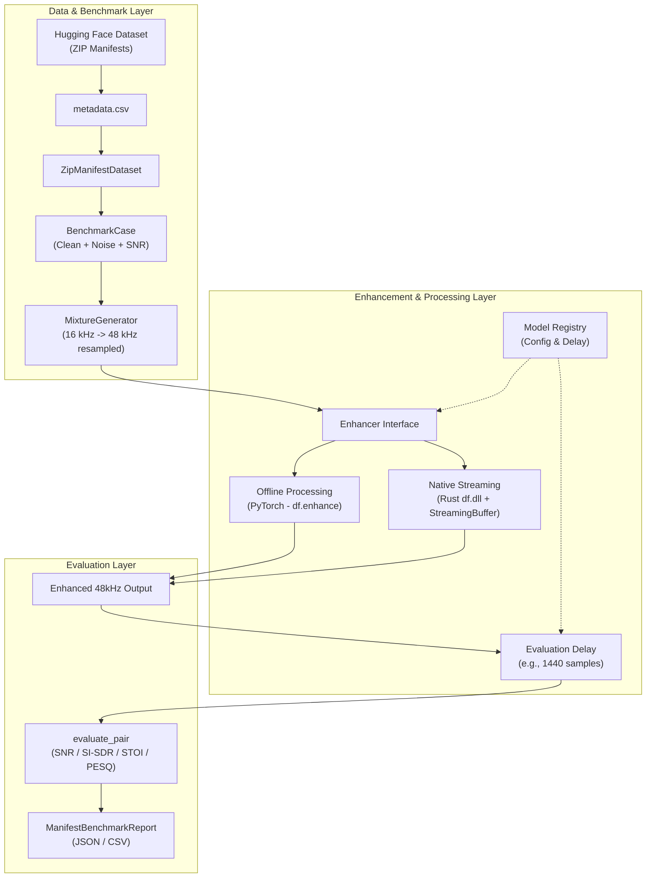

<div align="center">

# 🎧 DRDO-ANC

### An End-to-End Real-Time Active Noise Cancellation & Benchmarking Framework

<br>

[](https://www.python.org/downloads/)
[](https://doc.qt.io/qtforpython-6/)
[](https://pytorch.org/)
[](https://www.rust-lang.org/)
[](https://opensource.org/licenses/MIT)

<br>


<p align="center">
  <a href="#-system-architecture">Architecture</a> •
  <a href="#-framework-layers">Core Layers</a> •
  <a href="#-models--dsp">Models & DSP</a> •
  <a href="#-real-time-telemetry-gui">Real-Time GUI</a> •
  <a href="#-installation">Installation</a> •
  <a href="#-usage">Usage</a>
</p>

</div>

---

## 🔬 Project Overview

**DRDO-ANC** is a highly specialized AI/ML-enabled adaptive noise cancellation and speech enhancement project engineered for defense communication. This infrastructure supports both deterministic offline DSP benchmarking and ultra-low-latency real-time hardware execution.

### Key Capabilities
* **Lazy Audio Loading:** Ingests large Hugging Face audio datasets directly from ZIP-backed manifests (`ZipManifestDataset`).
* **Deterministic Benchmarking:** Generates reproducible clean/noise/SNR mixtures dynamically for offline evaluation.
* **Dual-Mode Execution:** Runs **DeepFilterNet3 (DF3)** in both batch-offline mode via PyTorch and zero-overhead native streaming mode via a Rust-compiled `.dll`.
* **Synchronous Hardware I/O:** Executes a live microphone-to-speaker pipeline natively mapped to dual-channel or independent-device hardware.
* **DSP Primitives:** Features an integrated **NLMS adaptive residual-noise filter** independent of the ML enhancements.
* **Supervised Classification:** Employs a recording-safe, split-stratified `SupervisedNoiseClassifier` (v2) for defense-specific noise identification (UAV Drone, Impulsive Firearms, Vehicle Engine).

---

## 🏗 System Architecture

DRDO-ANC establishes a strictly layered, reproducible pipeline bridging Hugging Face datasets with real-time streaming buffers and delay compensation mechanics.



---

## 🧠 Framework Layers

The codebase is highly modularized, cleanly separating manifest parsing from DSP primitives and hardware I/O.

| Layer | Responsibility | Key Abstractions & Features |
|-------|----------------|-----------------------------|
| **Dataset** | Lazy Audio Corpus | `ZipManifestDataset`, reading metadata without unzipping large corpuses. |
| **Benchmark** | Reproducible Eval | `MixtureGenerator`, `ManifestBenchmarkRunner`. Generates deterministic noise scenarios and saves JSON reports. |
| **Enhancement** | Model Interface | The `Enhancer` ABC. Implements `DeepFilterNetEnhancer` and `FineTunedDeepFilterNetEnhancer`. |
| **DSP** | Signal Processing | The `NLMSFilter`. A model-independent NumPy implementation of the Normalized Least Mean Squares algorithm. |
| **Classification** | Defence Noise ID | `SupervisedNoiseClassifier` utilizing stratified `sklearn` pipelines (LR/RF/ExtraTrees) to identify drones, firearms, and engines. |
| **Live Audio** | Hardware Streaming| Duplex I/O via `SoundDeviceDuplexSession`. Fully synchronous `StreamingPipeline` supporting independent dual-microphones. |
| **Real-Time GUI** | Telemetry Frontend | PySide6 + QML decoupled interface. Zero audio-thread blocking. |

---

## 🚀 Models & DSP Deep-Dive

DRDO-ANC evaluates enhancements fairly by isolating architecture-specific delays. 

### DeepFilterNet3 Implementation

Integrated into the `Model Registry`, DF3 operates in two distinct modes:

1. **Offline Path (PyTorch)**
   - Utilizes `df.enhance(model, df_state, audio)`.
   - Expects full 48 kHz `[1, T]` floating-point tensors.
   - Algorithmic evaluation delay: `0 samples`.

2. **Native Streaming Path (Rust `.dll`)**
   - Utilizes `NativeDF3Backend` via `ctypes` wrapping `df_process_frame`.
   - Converts arbitrary hardware incoming chunks (e.g. 1024 samples) into strictly **480-sample** DF3 frames using `StreamingBuffer`.
   - The final partial frame is zero-padded during the `flush()` shutdown semantics.
   - Algorithmic evaluation delay: **1440 samples** (30 ms at 48kHz). The evaluation framework rigorously compensates for this via `apply_evaluation_delay()`.

### Adaptive DSP (NLMS)

A standalone `NLMSFilter` module acts as a highly optimized, pure NumPy post-processing step to attenuate correlated hardware noise using dual-microphone configurations (Primary & Reference).

---

## 📊 Real-Time Telemetry GUI

The live telemetry interface is engineered for absolute performance. **The GUI is strictly observational: it may drop a visual frame, but the audio pipeline never stalls.**

<div align="center">
  
</div>

### Architectural Highlights
- **Decoupled Bridge:** The `GUIBridge` utilizes a 60 FPS `QTimer` to perform thread-safe latest-value handoffs from the audio daemon.
- **GPU Canvas:** High-performance QML `Canvas` rendering glowing waveforms from `WaveformProcessor`'s peak-preserving downsampled arrays (max 500 points).
- **Telemetry Sparklines:** DevOps-style tracking of **Real-Time Factor (RTF)**, Processing Latency (ms), and Buffer Overflows.

---

## 📁 Repository Structure

```text
DRDO-ANC/
├── data/                               # Generated reports and WAV captures
├── docs/                               # Additional documentation & assets
├── models/
│   └── dfn3_finetuned/                 # Fine-Tuned DF3 ONNX bundle and checkpoints
├── scripts/
│   ├── run_live_gui.py                 # Telemetry Frontend Entry Point
│   ├── run_df3_manifest_benchmark.py   # Main Evaluation CLI
│   ├── run_usb_bluetooth_dual_mic_experiment.py # Task 6 Multi-Mic Logic
│   ├── train_noise_classifier_v2.py    # Rule-Based / Supervised Classification
│   └── test_*.py                       # Unit & Integration Testing Suite
└── src/drdo_anc/
    ├── audio/                          # I/O, Mixing, Resampling, Live PortAudio 
    ├── benchmark/                      # Deterministic JSON Manifest Parsers
    ├── classification/                 # Noise categorization features & eval
    ├── dataset/                        # HF integration & Lazy Zip reads
    ├── dsp/                            # NLMS Filtering primitives
    ├── enhancement/                    # Model Registry, DF3 bindings, Buffers
    ├── experiments/                    # Local vs FineTuned comparative modules
    └── gui/                            # PySide6 Bootstrapping & QML Assets
```

---

## ⚙️ Installation

**Prerequisites:** Python 3.10+ and a standard C++ build chain (for specific wheel compilation if needed).

1. **Clone the Repository:**
   ```bash
   git clone https://github.com/Panav-Payappagoudar/DRDO-ANC.git
   cd DRDO-ANC
   ```

2. **Initialize Environment & Dependencies:**
   ```bash
   python -m venv .venv
   source .venv/bin/activate  # On Windows: .venv\Scripts\activate
   
   # Install local framework in editable mode
   pip install -e .
   
   # Install audio I/O and scientific stack
   pip install sounddevice soundfile numpy torch scipy scikit-learn
   
   # Install GUI prerequisites
   pip install PySide6
   
   # Install Enhancement Backends
   pip install deepfilternet
   ```

> [!NOTE]
> Ensure the native DeepFilterNet DLLs are accessible or properly compiled based on the `deepfilternet.py` registry pathways.

---

## 💻 Usage & CLI Entrypoints

### 1. Real-Time Telemetry GUI
Launch the GPU-accelerated monitoring interface. Defaults to "Demo Mode".

```bash
# Production UI
python scripts/run_live_gui.py

# Auto-start hardware capture with specific mic/speaker devices
python scripts/run_live_gui.py --live-on-start --input-device 20 --output-device 18
```

### 2. Offline Deterministic Benchmarking
Evaluate the registered AI models against the 60-case Hugging Face dataset. Calculates SI-SDR, STOI, PESQ, and SNR metrics.

```bash
python scripts/run_df3_manifest_benchmark.py --model DeepFilterNet3
```

### 3. Noise Classification
Evaluate the custom trained V2 Supervised Classifier on defense-specific corpora.

```bash
python scripts/run_noise_classifier_corpus_eval.py
```

### 4. Hardware Diagnostic Pass-through
Bypass all enhancements to verify system duplex limits and latency.

```bash
python scripts/test_live_passthrough.py --mode pipeline
```

---

<div align="center">
  <i>Engineered for <b>Deterministic Evaluation</b>. Designed for <b>Zero-Delay Streaming</b>.</i>
</div>